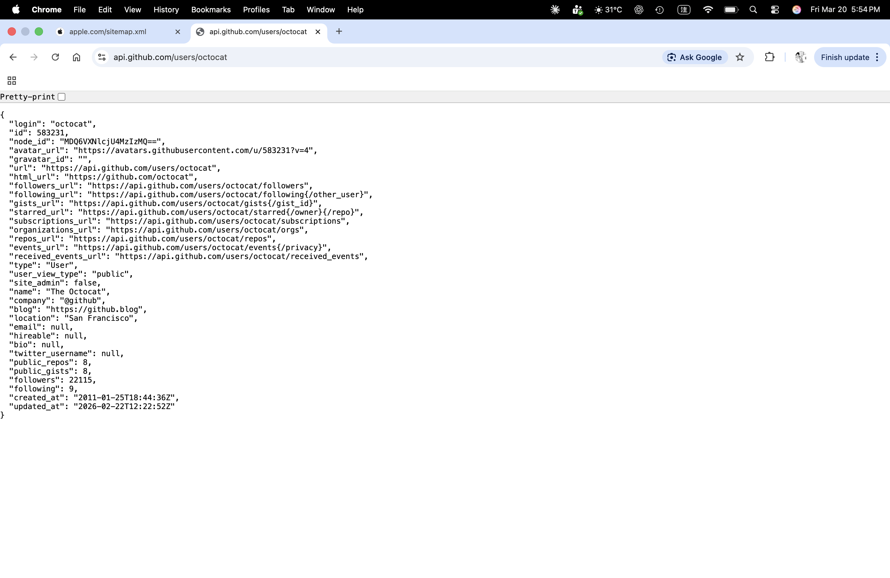
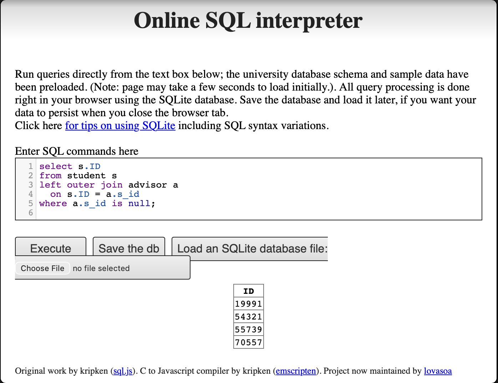
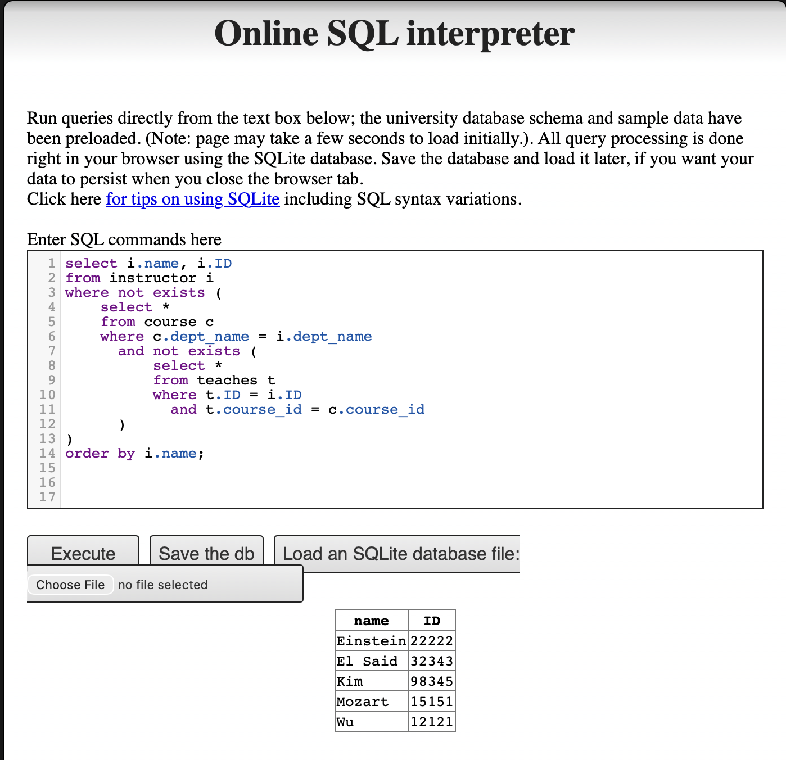
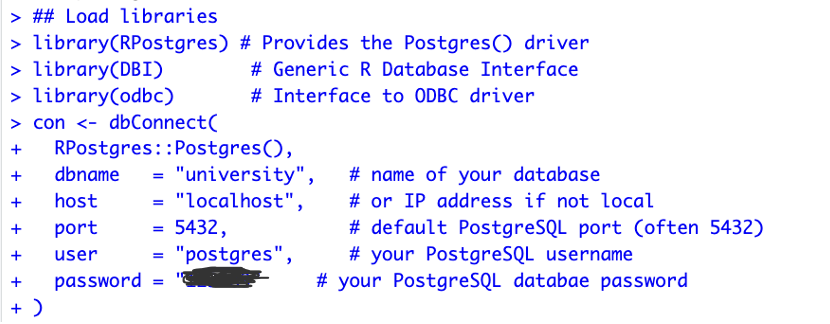
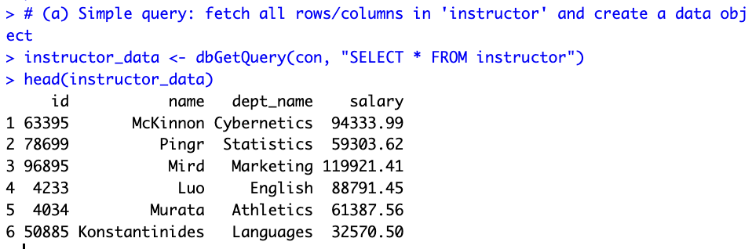
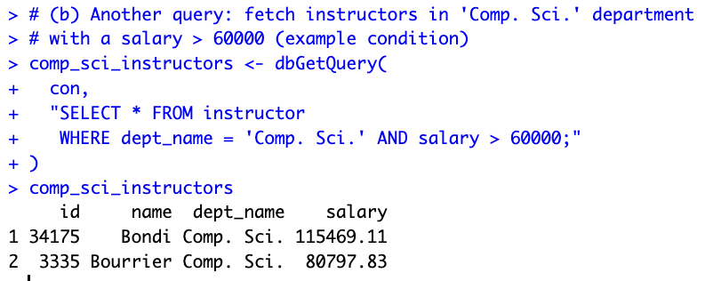
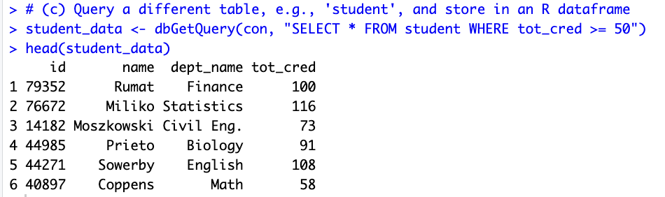
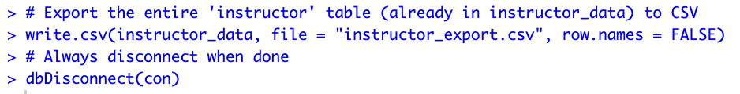

---
project:
  output-dir: docs
title: "資訊管理"
format:
  html:
    theme: cosmo
    toc: true
    toc-location: right
    toc-depth: 6
    number-sections: false
    page-layout: full
    smooth-scroll: true
editor:
  markdown:
    wrap: 72
---

## 作業

### 作業 1

#### 問題 1

**請列舉並描述三個你使用過的、透過資料庫系統來儲存與存取持久性資料的應用程式。**（例如：航空公司、線上交易、銀行、大學系統）

第一個例子是電子遊戲。在遊戲中，玩家的等級和經驗值，以及獲得的道具和裝備都會被記錄下來，這樣玩家下次登入時仍然可以存取這些資料。另一個例子是線上購物。例如 Amazon 會記錄每件商品的價格、所屬目錄、是否符合免運資格，以及是否有庫存等資訊。第三個例子是串流平台，如 Netflix，會記錄使用者的地區和訂閱等級。所有這些資料都被持久性地儲存，並可在之後隨時存取。

#### 問題 2

**請針對領域專案提出三個應用程式**（例如：犯罪學、經濟學、腦科學等）。請確保包含：i. 目的 ii. 功能 iii. 簡易介面設計

##### 衣櫥管理資料庫

###### i. 目的

這個衣櫥管理資料庫的主要目的是減少出門前選擇穿搭所花費的時間。

對許多人來說，每日穿搭的困難不在於缺少衣物，而在於需要同時考慮顏色、風格、場合與整體搭配，這導致了很高的決策成本。

因此，我將衣櫥建模為關聯式資料庫，不僅記錄個別衣物，還描述衣物之間的關係，讓穿搭選擇能以系統化的方式處理。

透過結構化衣物資料，此系統旨在將「每天重新思考要穿什麼」轉變為「從資料庫中快速選擇最佳組合」。

###### ii. 功能

在此系統中，每件衣物被視為一個資料實體，並以一組屬性來描述，例如：

-   類別（T恤、牛仔褲、外套、鞋子）
-   顏色（包含各顏色的比例）
-   風格（簡約風、正式、復古、運動等）
-   材質（牛仔、亞麻、棉質）

這些屬性被正規化為多個資料表，並使用多對多關係來表示一件衣物可以屬於多種風格或適合不同場合。

此資料庫的核心功能不僅在於儲存衣物，更在於描述衣物之間的搭配性。

系統使用搭配規則來定義：

-   視覺美學限制，例如單套穿搭不超過三種顏色，並限制風格標籤數量以維持整體一致性
-   氣候適應性，根據保暖相關變數評估組合，確保上下半身的保暖度平衡，且隨溫度降低偏好更高的整體保暖度

當使用者選擇特定衣物（例如一件粉紅色 T 恤）時，系統可以根據資料庫中的關係和規則，立即推薦其他高度搭配的衣物（如淺藍色牛仔褲和白色運動鞋），並按搭配分數排列這些組合，幫助使用者更有效率地做出決策。

此外，隨著資料累積，系統可以分析衣櫥的整體結構，例如：

-   某些風格或衣物類別是否欠缺
-   顏色或衣物類型是否過度集中
-   新購買的衣物是否與現有衣物功能重疊
-   哪些舊衣物長期未使用，可考慮淘汰

這使得衣櫥不僅僅是一個物品清單，而是一個可以查詢、分析和優化的系統，並可延伸至穿搭推薦和購買決策支援等日常生活應用。

此問題特別適合使用關聯式資料庫，因為穿搭選擇本質上涉及結構化資料和多對多關係（如衣物、風格和搭配規則），這些可以透過關聯式查詢進行高效的組合與分析。

###### iii. 簡易介面設計

使用者進入系統時，首頁顯示衣櫥中所有衣物的表格視圖，包含類別、顏色、風格、材質和季節性等基本資訊。介面支援多選功能。

使用者可以選擇一件或多件計畫穿著的衣物，並提交選擇以產生穿搭結果。

根據所選衣物和資料庫中儲存的搭配規則，系統會產生多個候選穿搭。

穿搭結果頁面提供不同的排序選項，例如按舒適度分數、美觀分數或氣候適合度分數排序。

每套穿搭都顯示對應的數值分數，讓使用者可以快速比較選項並選擇最合適的組合，無需反覆試穿或過度思考。

介面支援快速決策：選擇衣物 → 產生穿搭 → 按分數排序 → 挑選最佳搭配。

##### 3D 列印農場訂單與排程資料庫

###### i. 目的

此 3D 列印農場資料庫的目的是將整個工作流程系統化——從客戶下單到自動估算、機器排程和進度追蹤——使農場能在訂單量增長時高效運作。目標是縮短交貨時間、減少人工排程錯誤、提高機器利用率並最大化收益。

在實務中，3D 列印訂單差異很大（模型大小、材料、解析度、多色需求，以及後處理如上色等）。如果定價和排程依賴人工判斷，很容易低估時間/成本、分配錯誤的機器，或在訂單佇列中造成瓶頸。因此，此系統使用關聯式資料庫以結構化方式儲存訂單、機器能力、材料用量和排程狀態，透過規則和查詢實現快速且一致的決策。

###### ii. 功能

**訂單接收與需求標記**

當客戶提交訂單時，系統將其儲存為具有結構化屬性的訂單記錄，例如：

-   模型大小與體積（包圍盒 / 體積）
-   列印類型（FDM / SLA）
-   解析度設定（層高 / 解析度）
-   多色需求
-   材料類型
-   後處理需求（例如上色/打磨）
-   其他客製化需求（以標籤儲存）

這些欄位可正規化為多個資料表，使用多對多關係來表示一張訂單可以有多個需求標籤。

**逐機估算**

關鍵不僅在於計算訂單的整體價格，而是估算同一訂單在不同機器上的表現，因為時間、成本和完成時間可能因機器而異。這有助於更好的機器分配和排程決策。

對於每台候選機器，系統套用定價規則或估算模型進行逐機估算，包括：

-   預估列印時間
-   預估材料用量
-   機器專屬的預估成本與報價
-   預估完成時間（考慮當前工作負載）

系統儲存這些「訂單 × 機器」的估算結果，以便使用不同目標函數進行查詢和排名，例如最低成本、最早完成或在期限內最穩定的選項。

**訂單佇列與狀態追蹤**

所有訂單自動加入訂單佇列，每張訂單維護清楚的狀態，例如：

-   pending（待處理）
-   queued（已排入佇列）
-   printing（列印中）
-   post-processing（後處理中）
-   completed（已完成）
-   failed（失敗）

管理者可以查詢：

-   目前佇列中有什麼及其優先順序
-   哪些訂單正在列印 vs. 等待機器
-   哪些失敗的訂單需要重印或人工介入

**機器能力建模與分配建議**

資料庫儲存每台機器的能力和限制，例如：
- 機器類型：多色 / 單色 / SLA / FDM
- 最大建構體積
- 支援的材料
- 速度/品質特性
- 當前工作負載與可用性

當新訂單到達時，系統先進行限制過濾（例如大小、材料、多色需求）以識別可行的機器，然後使用逐機估算產生推薦分配，例如：

-   最早完成時間
-   最低預估成本
-   平衡選項（期限 + 穩定性）

這將排程轉變為決策支援流程，而非人工猜測。

###### iii. 簡易介面設計

在客戶端，系統提供客戶訂單頁面，使用者可上傳 3D 模型或指定列印需求，如大小、材料、解析度、多色選項和後處理需求。根據這些資訊，系統自動回傳預估價格和預估交貨時間。

在管理端，系統提供訂單儀表板，顯示當前訂單佇列和訂單狀態。管理者可按期限、優先順序或處理狀態排序或篩選訂單，以更有效率地管理工作流程。

系統還包含機器儀表板，列出所有可用機器及其機器類型、最大建構體積、支援的材料、當前工作負載和預估可用性。這讓操作人員可以快速了解機器容量和限制。

當選擇一張訂單時，排程視圖呈現可完成該訂單的候選機器清單。對於每台候選機器，系統顯示預估列印時間、預估材料用量、機器專屬成本與報價，以及預估完成時間。介面支援一鍵排序選項，例如最快、最便宜或最穩定，以協助管理者做出分配決策。

介面支援高效操作：提交訂單 → 逐機估算 → 排入佇列 → 推薦機器 → 排程與追蹤進度。

##### 農場灌溉管理資料庫

###### i. 目的

此系統的目的是使用關聯式資料庫管理農場的核心資訊——如田地、作物類型、生長階段和灌溉設備。

同時，系統透過天氣預報服務提供的 API 擷取並儲存天氣資料，並結合這些資訊與一組灌溉規則，自動產生每日灌溉排程。

目標是降低人工決策成本，同時提高用水效率和作物管理的一致性。

###### ii. 功能

在此系統中，資料庫不僅用於資料儲存。其核心功能是整合農場內部資訊與外部天氣資料，並根據預定義的規則自動產生灌溉決策。

**核心資料管理**

系統使用關聯式架構管理農場的主要實體，包括：

-   田地：田地 ID、位置、面積，以及目前種植的作物
-   作物：作物類型及其基本用水需求
-   生長階段：如發芽、生長、開花和結果等階段，每個階段有不同的用水需求
-   灌溉設備：設備類型（如滴灌、噴灌）、流量或效率係數，以及可用狀態

這些實體透過關係連接。例如，每塊田地關聯到特定作物和當前生長階段，並可分配可用的灌溉設備。

**天氣資料整合**

系統透過外部天氣預報 API 擷取天氣資訊，例如：

-   預測降雨量
-   降水機率
-   溫度範圍

此天氣資料儲存在資料庫中，作為每日灌溉決策的重要輸入，無需使用者手動輸入。

**灌溉規則與排程產生**

系統維護一組灌溉規則，描述不同條件下的灌溉需求，例如：

-   作物類型 × 生長階段 → 建議基準灌溉量
-   若預測降雨量超過某一門檻 → 自動減少或取消當日灌溉
-   灌溉設備效率差異 → 調整實際灌溉時間

當每日排程流程執行時，系統結合：

-   每塊田地的作物類型和生長階段
-   當日天氣預報
-   灌溉設備的可用性和效率

根據這些資訊，系統自動產生每日灌溉排程，指示每塊田地是否需要灌溉以及建議的用水量或灌溉時間。

###### iii. 簡易介面設計

使用者進入系統時，首頁顯示農場所有田地的表格視圖，包含當前作物類型、生長階段，以及系統當日的灌溉建議。

使用者可以透過單一操作產生每日灌溉排程。根據田地資訊、天氣預報和灌溉規則，系統列出哪些田地需要灌溉，並提供建議的用水量或灌溉時間。

排程以簡單的清單格式呈現，讓使用者可以快速檢閱並執行灌溉任務。完成後，使用者可標記灌溉狀態以供記錄和日後參考。

#### 問題 5

**當前資料庫系統無法做到的事情有哪些？**

當前資料庫系統無法理解資料背後的語義。因此，在更複雜的應用中，它們通常依賴人工定義的規則或持續調整的權重來產生合理的輸出。此外，資料庫在處理跨情境決策方面能力有限，即需要同時平衡多個相互競爭的目標。

例如，在衣櫥管理資料庫中，系統可以根據結構化標準（如色彩組合、風格標籤、材質屬性和天氣條件）評估穿搭。它可以為美觀度、舒適度和氣候適合度等因素評分，並產生多個符合預定義規則的候選穿搭。然而，資料庫無法判斷哪套穿搭在視覺吸引力、舒適度和天氣適合度之間達到最佳平衡。

這個限制源於「好看」或「舒適」等偏好本質上是主觀且依情境而定的，不存在適用於所有使用者或所有情境的單一最佳解。因此，資料庫的角色不是做出最終決策，而是透過過濾不可行的選項、結構化相關資訊，以及呈現具有透明評估指標的可比較替代方案來支援決策。

最終，最終選擇必須由使用者做出，他們可以在特定情境中決定優先考慮舒適度、美觀度還是氣候適合度。這突顯了當前資料庫系統的根本限制：它們在決策支援方面很有效，但無法在複雜的、價值驅動的決策中取代人類判斷。

#### 問題 6

**描述至少三個可能用於儲存社交網路/社群媒體系統（如 Twitter 或 Reddit）資訊的資料表。**

社交網路或社群媒體系統（如 Twitter 或 Reddit）至少可能由以下三個核心資料表支撐：

**1. 使用者資料表（User Table）**

使用者資料表儲存使用者的基本資訊，例如：
- user_id
- username
- 帳號建立時間
- 個人檔案元資料（如自我介紹或狀態）

此資料表代表使用者的身分，並作為系統中其他資料表的參照。

**2. 貼文資料表（Post Table）**

貼文資料表儲存使用者建立的內容，例如：

-   post_id
-   author_id（外鍵，參照 User 資料表）
-   content
-   timestamp

每篇貼文關聯到特定使用者，形成使用者與貼文之間的一對多關係。

**3. 留言資料表（Comment Table）**

留言資料表儲存對貼文（或其他留言）的回覆，例如：

-   comment_id
-   post_id（外鍵，參照 Post 資料表）
-   author_id
-   content
-   timestamp

此資料表支援串連式討論，允許多位使用者參與同一貼文下的對話。

這些資料表被分開以支援關聯式查詢、維護資料一致性，並實現使用者、貼文和討論串的高效檢索。

### 作業 2

#### 問題 1

**關聯式綱要（relation schema）、關聯（relation）和實例（instance）之間有什麼區別？請以大學資料庫為例說明。**

-   **關聯式綱要（Relation Schema）** = 關聯的邏輯結構：一組屬性名稱及其定義域的列表。它不隨時間改變。\
    *範例：* `instructor(ID, name, dept_name, salary)`

-   **關聯（Relation）** = 非正式地用來同時指綱要和實例。\
    *範例：* 「department 關聯」可以指綱要
    `department(dept_name, building, budget)` 或其目前持有的實際資料。

-   **實例（Instance）** = 關聯在特定時間點的實際資料快照。它隨著元組的插入、更新或刪除而改變。\
    *範例：* 圖 2.5 中的 department 關聯實例包含 7 個元組。如果大學新增一個「Data Science」學系，實例會增長到 8 個元組，但綱要仍為
    `department(dept_name, building, budget)`。

#### 問題 2 & 3

**請繪製以下銀行資料庫的綱要圖。標示主鍵（底線）和外鍵。**

此銀行資料庫由以下關聯組成：

-   `branch(branch_name, branch_city, assets)`
-   `customer(ID, customer_name, customer_street, customer_city)`
-   `loan(loan_number, branch_name, amount)`
-   `borrower(ID, loan_number)`
-   `account(account_number, branch_name, balance)`
-   `depositor(ID, account_number)`

{width="80%"}

#### 問題 4

**描述人工智慧或 LLM 可以如何協助管理或查詢資料庫的兩種方式。在回答中，簡要說明每種方式相比傳統（非 AI）方法如何提升效率或準確度。（3-5 句）**

1.  **自然語言轉 SQL（查詢）：** LLM 可以將自然語言問題直接翻譯為可執行的 SQL 查詢，降低非技術使用者的門檻，並減少手寫 SQL 時的語法錯誤。

2.  **AI 驅動的資料庫調優（管理）：** LLM 可以自動分析慢速查詢並建議索引優化，取代 DBA 手動檢查查詢日誌和執行計畫這一傳統耗時的過程。

整體而言，這兩種方法都減少了對專業知識的需求，並相比傳統手動方法實現更快、更準確的資料庫操作。

### 作業 3

#### 問題 1

開啟線上 SQL 直譯器並載入大學資料庫。

#### 問題 2

**撰寫 SQL 程式碼以取得以下清單：i. 學生 ID、ii. 教師、iii. 系所**

{width="80%"}

#### 問題 3

**撰寫 SQL 程式碼執行以下查詢：**

**i. 找出修過至少一門資訊科學課程的每位學生的 ID 和姓名；確保結果中沒有重複姓名。**

{width="80%"}

**ii. 將成績加入清單**

{width="80%"}

**iii. 找出未修過任何 2017 年之前開設課程的每位學生的 ID 和姓名。**

{width="80%"}

**iv. 對每個系所，找出該系教師的最高薪資。**

{width="80%"}

**v. 找出前一題計算的各系最高薪資中的最低值。**

{width="80%"}

**vi. 將教師姓名加入清單**

{width="80%"}

#### 問題 4

**找出從未在其教授的任何課程中給過 A 等成績的教師（含姓名和 ID）。（從未教過課程的教師自然滿足此條件。）**

{width="80%"}

### 作業 6

#### 問題 1 — 使用 JSON 和 XML 的網站

**查找包含以下資料表示方式的網站：a) 使用 JSON、b) 使用 XML。分析這些網站的結構與組成，並說明用於建立網頁資料庫的技術/方法。**

##### a) JSON 範例 — GitHub API 使用者資料

**URL：** `https://api.github.com/users/octocat`

此頁面以 JSON 格式顯示公開的 GitHub 使用者資料。資料以 JSON 物件回傳，包含許多鍵值對，例如 `login`、`id`、`html_url`、`followers` 和 `created_at`。

{width="80%"}

**結構與組成：**

-   外層結構是由 `{ }` 標記的 JSON 物件。
-   每個欄位以鍵值對儲存，例如 `"login": "octocat"`。
-   回應包含字串、數字、URL、布林值和 null 值。
-   此格式輕量且便於網站和應用程式交換資料。

**可能使用的技術/方法：**

-   REST API
-   後端網路服務
-   資料庫支援，如 PostgreSQL、MySQL 或 NoSQL 系統
-   JSON 回應用於網頁和應用程式資料交換

##### b) XML 範例 — Apple 網站地圖

**URL：** `https://www.apple.com/sitemap.xml`

此頁面以 XML 格式顯示 Apple 的網站地圖。它列出網頁連結，以便搜尋引擎發現和索引該網站。

{width="80%"}

**結構與組成：**

-   根元素為 `<urlset>`。
-   每個網頁條目儲存在重複的 `<url>` 元素中。
-   實際頁面地址儲存在 `<loc>` 標籤內。
-   資料以階層式標籤結構組織，這是 XML 的關鍵特徵。

**可能使用的技術/方法：**

-   XML 網站地圖標準
-   網站內容發布系統或 CMS
-   從網站資料庫產生的後端資料
-   搜尋引擎索引支援

##### 快速比較

-   JSON 較為簡短，適合網頁 API 和應用程式。
-   XML 使用標籤和階層結構，適合結構化文件和網站地圖。
-   兩種格式都有助於網站以有組織的方式儲存或交換資料。

#### 問題 2 — SQL 練習

##### i. 沒有指導教授的學生（左外連接）

**用不包含子查詢和集合操作的 SQL 表達以下查詢。（提示：左外連接）**

```sql
select ID
from student
except
select s_id
from advisor
where i_ID is not null
```

**思路：** 使用 `LEFT OUTER JOIN` 保留 `student` 的所有列。將 `student.ID` 與 `advisor.s_id` 匹配。若學生沒有匹配的指導教授列，則 advisor 欄位變為 `NULL`。因此，`where a.s_id is null` 回傳沒有指導教授的學生。

**SQL 答案：**

```sql
select s.ID
from student s
left outer join advisor a
  on s.ID = a.s_id
where a.s_id is null;
```

{width="80%"}

##### ii. 教授其系所所有課程的教師

**使用大學綱要，撰寫 SQL 查詢以找出那些教授其系所每門課程的教師姓名和 ID（即在 *course* 關聯中與該教師系所名稱相同的每門課程）。按姓名排序結果。**

**思路：** 對每位教師，先限定範圍為同系所的課程。然後檢查是否存在該教師未教授的系所課程。若不存在這樣的課程，則該教師教授了系所中的每門課程。這就是查詢使用 `NOT EXISTS` 嵌套另一個 `NOT EXISTS` 的原因。

**SQL 答案：**

```sql
select i.name, i.ID
from instructor i
where not exists (
    select *
    from course c
    where c.dept_name = i.dept_name
      and not exists (
          select *
          from teaches t
          where t.ID = i.ID
            and t.course_id = c.course_id
      )
)
order by i.name;
```

{width="80%"}

#### 問題 3 — R 與 PostgreSQL

##### a) 匯入完整資料庫

使用教科書網站提供的 DDL（資料定義語言）綱要和大型關聯插入檔案建立大學資料庫。

**DDL 綱要（`DDL.sql`）：**

```sql
create table classroom
    (building       varchar(15),
     room_number    varchar(7),
     capacity       numeric(4,0),
     primary key (building, room_number)
    );

create table department
    (dept_name      varchar(20),
     building       varchar(15),
     budget         numeric(12,2) check (budget > 0),
     primary key (dept_name)
    );

create table course
    (course_id      varchar(8),
     title          varchar(50),
     dept_name      varchar(20),
     credits        numeric(2,0) check (credits > 0),
     primary key (course_id),
     foreign key (dept_name) references department (dept_name)
        on delete set null
    );

create table instructor
    (ID             varchar(5),
     name           varchar(20) not null,
     dept_name      varchar(20),
     salary         numeric(8,2) check (salary > 29000),
     primary key (ID),
     foreign key (dept_name) references department (dept_name)
        on delete set null
    );

create table section
    (course_id      varchar(8),
     sec_id         varchar(8),
     semester       varchar(6)
        check (semester in ('Fall', 'Winter', 'Spring', 'Summer')),
     year           numeric(4,0) check (year > 1701 and year < 2100),
     building       varchar(15),
     room_number    varchar(7),
     time_slot_id   varchar(4),
     primary key (course_id, sec_id, semester, year),
     foreign key (course_id) references course (course_id)
        on delete cascade,
     foreign key (building, room_number) references classroom
        on delete set null
    );

create table teaches
    (ID             varchar(5),
     course_id      varchar(8),
     sec_id         varchar(8),
     semester       varchar(6),
     year           numeric(4,0),
     primary key (ID, course_id, sec_id, semester, year),
     foreign key (course_id, sec_id, semester, year)
        references section on delete cascade,
     foreign key (ID) references instructor (ID)
        on delete cascade
    );

create table student
    (ID             varchar(5),
     name           varchar(20) not null,
     dept_name      varchar(20),
     tot_cred       numeric(3,0) check (tot_cred >= 0),
     primary key (ID),
     foreign key (dept_name) references department (dept_name)
        on delete set null
    );

create table takes
    (ID             varchar(5),
     course_id      varchar(8),
     sec_id         varchar(8),
     semester       varchar(6),
     year           numeric(4,0),
     grade          varchar(2),
     primary key (ID, course_id, sec_id, semester, year),
     foreign key (course_id, sec_id, semester, year)
        references section on delete cascade,
     foreign key (ID) references student (ID)
        on delete cascade
    );

create table advisor
    (s_ID           varchar(5),
     i_ID           varchar(5),
     primary key (s_ID),
     foreign key (i_ID) references instructor (ID)
        on delete set null,
     foreign key (s_ID) references student (ID)
        on delete cascade
    );

create table time_slot
    (time_slot_id   varchar(4),
     day            varchar(1),
     start_hr       numeric(2) check (start_hr >= 0 and start_hr < 24),
     start_min      numeric(2) check (start_min >= 0 and start_min < 60),
     end_hr         numeric(2) check (end_hr >= 0 and end_hr < 24),
     end_min        numeric(2) check (end_min >= 0 and end_min < 60),
     primary key (time_slot_id, day, start_hr, start_min)
    );

create table prereq
    (course_id      varchar(8),
     prereq_id      varchar(8),
     primary key (course_id, prereq_id),
     foreign key (course_id) references course (course_id)
        on delete cascade,
     foreign key (prereq_id) references course (course_id)
    );
```

##### b) 執行 RPostgres01.R

R 腳本使用 `RPostgres` 和 `DBI` 連接本機 PostgreSQL 資料庫，執行三個查詢，匯出 CSV，然後中斷連線。

**載入套件並連線：**

{width="80%"}

**查詢 (a) — 取得所有教師：**

{width="80%"}

**查詢 (b) — 薪資 > 60000 的資訊科學系教師：**

{width="80%"}

**查詢 (c) — 總學分 >= 50 的學生：**

{width="80%"}

**匯出 CSV 並中斷連線：**

{width="80%"}

##### c) 結果

**R 腳本（`RPostgres01.R`）：**

```r
# Connect PostgreSQL database using R
# Packages: DBI, odbc, RPostgres
# Documentation:
## DBI: https://dbi.r-dbi.org
## RPostgres https://github.com/r-dbi/RPostgres
## R https://solutions.posit.co/connections/db/
## odbc: https://solutions.posit.co/connections/db/best-practices/drivers/

install.packages(c("RPostgres", "DBI", "odbc"))

## Load libraries
library(RPostgres)
library(DBI)
library(odbc)

## Connect to PostgreSQL and database
con <- dbConnect(
  RPostgres::Postgres(),
  dbname   = "university",
  host     = "localhost",
  port     = 5432,
  user     = "postgres",
  password = "123489"
)

## Perform queries

# (a) Simple query: fetch all rows/columns in 'instructor'
instructor_data <- dbGetQuery(con, "SELECT * FROM instructor")
head(instructor_data)

# (b) Fetch instructors in 'Comp. Sci.' department with salary > 60000
comp_sci_instructors <- dbGetQuery(
  con,
  "SELECT * FROM instructor
   WHERE dept_name = 'Comp. Sci.' AND salary > 60000;"
)
comp_sci_instructors

# (c) Query 'student' table: students with tot_cred >= 50
student_data <- dbGetQuery(con, "SELECT * FROM student WHERE tot_cred >= 50")
head(student_data)

## Export to CSV
write.csv(instructor_data, file = "instructor_export.csv", row.names = FALSE)

## Clean up
dbDisconnect(con)
```

### 作業 7 — AI 練習（Shiny）

製作並修改兩個 Shiny app，並部署到 **shinyapps.io** 上線執行。
App 1 將原本連接本機 PostgreSQL 的設定改為內嵌 **SQLite** 資料庫，讓
它能完全在雲端運作，不需要老師的電腦架設伺服器。

#### App 1 — 大學資料庫（SQLite + ggplot2）

**修改內容：**

-   **(a) 密碼 / 連線。** 原本連到 `localhost:5432` 的 `RPostgres`
    連線改成檔案式 SQLite：
    `dbConnect(RSQLite::SQLite(), "university.db")`。`university.db`
    由教科書的 `DDL.sql` 與 `largeRelationsInsertFile.sql`
    建立，隨 app 一起打包上傳。
-   **(b) 薪資排序改由高到低。** 將 `reorder(dept_name, y_value)`
    改為 `reorder(dept_name, -y_value)`，讓最高的長條排在最左邊。
-   **(c) 換另一個變數與另一張表。** 加了一個 `selectInput`
    下拉選單，可切換兩個查詢：教師平均薪資（`instructor`
    表）與學生平均總學分（`student` 表）。

**線上 app：** <https://chentzuyuan.shinyapps.io/epps6354-hw7-1/>

<iframe src="https://chentzuyuan.shinyapps.io/epps6354-hw7-1/" width="100%" height="650" style="border:1px solid #ccc; border-radius:8px;" loading="lazy"></iframe>

#### App 2 — Old Faithful 間歇泉直方圖

**修改內容：**

-   **(a) 長條圖顏色。** 將 `col = "blue"` 改為專案的統一配色 —
    填色 `#18A3A380`（青綠，`color1`）、邊框 `#FF4D8DCC`（粉紅，`color2`），與 App 1 保持一致。

**線上 app：** <https://chentzuyuan.shinyapps.io/epps6354-hw7-2/>

<iframe src="https://chentzuyuan.shinyapps.io/epps6354-hw7-2/" width="100%" height="550" style="border:1px solid #ccc; border-radius:8px;" loading="lazy"></iframe>

### 作業 8 — NBA 資料庫 Shiny App

依照 workshop
[datageneration/informationmanagement — workshop/Shiny](https://github.com/datageneration/informationmanagement/tree/master/workshop/Shiny)
的流程，從 PostgreSQL 建表 → 轉 SQLite → 寫 Shiny → 部署到
**shinyapps.io**，整條 pipeline 跑完並上線。

#### a) 在本機 PostgreSQL 建 NBA database

把課程提供的 `NBAPlayers.sql` 載入新建的 PostgreSQL 18 資料庫
`NBAplayers`：

```bash
createdb -U postgres NBAplayers
psql -U postgres -d NBAplayers -f NBAPlayers.sql
```

成功建立三張表：`player`（4,501 筆）、`player_salary`（1,292 筆）、
`player_photos`（4,593 筆）。

#### b) Export 成 SQLite

由於 SQL 檔的 `CREATE TABLE` 語法本身就相容 SQLite，可以直接把
同一個檔案匯入 SQLite 資料庫檔 `nba.db`，不需要做語法轉換：

```bash
sqlite3 nba.db < NBAPlayers.sql
```

`nba.db` 三張表的筆數與 PostgreSQL 完全一致（4,501 / 1,292 /
4,593），確認 export 乾淨。

#### c) 嵌入 Shiny

App 採用老師提供的模板結構：一個 slider 控制要顯示幾位現役球員，
資料以 `DT` DataTable 呈現，每筆紀錄的頭像直接以 `` 標籤嵌在
表格中。

Query 用 `idPlayer` 將 `Player` 與 `Player_Photos` 做 inner
join，並過濾 `is_active = 1`：

```sql
SELECT p.id, p.first_name, p.last_name, p.full_name,
       pp.urlPlayerHeadshot
FROM Player p
INNER JOIN Player_Photos pp ON pp.idPlayer = p.id
WHERE p.is_active = 1
LIMIT <slider_value>;
```

頭像欄位以 `escape = FALSE` 渲染，讓 URL 直接變成圖片：

```r
table_df$headshot <- paste0(
  '</img>'
)
```

採用與作業 7 相同的配色（`#18A3A380` 表頭、`#FF4D8DCC`
邊框），透過自訂 CSS 套用，與整個網站風格一致。

#### d) 部署到 Shinyapps.io

```r
rsconnect::deployApp(
  appDir   = "nba-shiny",
  appName  = "epps6354-hw8-nba",
  appFiles = c("app.R", "nba.db")
)
```

`nba.db` 隨 app 一起打包上傳，部署的執行環境完全 self-contained，
不需要連外部資料庫。

**線上 app：** <https://chentzuyuan.shinyapps.io/epps6354-hw8-nba/>

<iframe src="https://chentzuyuan.shinyapps.io/epps6354-hw8-nba/" width="100%" height="700" style="border:1px solid #ccc; border-radius:8px;" loading="lazy"></iframe>

## 期末專案

### 天氣與場合感知的衣櫥資料庫及規則式穿搭推薦系統

#### 專案概述

一個單人使用的衣櫥管理系統。每天早上，系統讀取使用者的行事曆（以判斷場合）和當前天氣，過濾掉不可穿著的衣物（髒的或已封存的），並使用基於色彩理論、布料搭配性和風格一致性的規則式評分引擎對候選穿搭進行排名。輸出為最佳推薦穿搭加上 3-5 個排名替代方案，每個都附有分數和說明。

**核心工作流程：** 起床 → 讀取行事曆（場合）+ 天氣 → 過濾可穿著衣物 → 評分穿搭組合 → 輸出推薦

**三個評分維度：**

-   **色彩** — 60/30/10 色彩理論；每件衣物帶有 `主色 / 副色 / 點綴色` 的色彩角色
-   **布料** — 同布料加分、混合布料合理性、相對於天氣的保暖充足度
-   **風格** — 衣物間風格標籤的一致性，以及風格與場合的適配分數

#### 資料庫資料表（簡化版 — 7 張表）

原始設計使用 21 張正規化資料表。為降低複雜度同時保留所有核心功能，綱要被整合為 7 張表，方法為：(1) 移除 `User` 表（單人系統），(2) 將查找表（Category、Color、Fabric、StyleTag）吸收為 `ClothingItem` 的 JSON 欄位，(3) 將明細表合併到主表，(4) 將穿著追蹤與洗衣統一為單一事件日誌。

##### 實體關係圖

```{mermaid}
erDiagram
    ClothingItem {
        INT item_id PK
        VARCHAR name
        VARCHAR category
        VARCHAR fabric
        INT warmth_weight
        INT breathability
        JSON colors
        JSON styles
        INT formality_score
        INT clean_score
        VARCHAR status
    }

    Occasion {
        INT occasion_id PK
        VARCHAR name
        INT formality_min
        INT formality_max
        JSON style_fit
    }

    CalendarEvent {
        INT event_id PK
        INT occasion_id FK
        DATE event_date
        TIME start_time
    }

    Weather {
        INT weather_id PK
        VARCHAR condition_name
        DECIMAL temp_c
        DECIMAL feels_like_c
        INT humidity
        DECIMAL wind_speed
        DECIMAL precip_mm
    }

    Outfit {
        INT outfit_id PK
        INT occasion_id FK
        INT weather_id FK
        JSON items
        INT color_score
        INT fabric_score
        INT style_score
        INT total_score
        TEXT explanation
    }

    ScoringRule {
        INT rule_id PK
        VARCHAR rule_type
        VARCHAR description
        JSON condition_json
        INT score_delta
        DATE valid_from
        DATE valid_until
    }

    WearLog {
        INT log_id PK
        INT item_id FK
        INT outfit_id FK
        VARCHAR event_type
        TIMESTAMP event_date
        INT delta_clean
        INT clean_score_after
    }

    Occasion ||--o{ CalendarEvent : "擁有"
    Occasion ||--o{ Outfit : "產生"
    Weather ||--o{ Outfit : "條件"
    Outfit ||--o{ WearLog : "記錄"
    ClothingItem ||--o{ WearLog : "追蹤"
    ScoringRule }o--o{ Outfit : "評估"
```

##### 1. ClothingItem（衣物項目）

| 欄位 | 型別 | 說明 |
|------|------|------|
| `item_id` | INT PK | 唯一識別碼 |
| `name` | VARCHAR(50) | 衣物名稱（如「海軍藍牛津襯衫」） |
| `category` | VARCHAR(20) | 類別：上衣、下裝、鞋子、外套、配件 |
| `fabric` | VARCHAR(20) | 布料類型（如棉、牛仔、亞麻、聚酯纖維） |
| `warmth_weight` | INT | 保暖度評分 (0–100) |
| `breathability` | INT | 透氣度評分 (0–100) |
| `colors` | JSON | 顏色角色：`[{"name":"navy","role":"primary"},{"name":"white","role":"accent"}]` |
| `styles` | JSON | 風格標籤：`["clean fit","formal"]` |
| `formality_score` | INT | 正式度 (0–100) |
| `clean_score` | INT | 清潔度（100 = 剛洗好，0 = 需要洗）；僅在 > 0 時可被推薦 |
| `status` | VARCHAR(10) | `active` 或 `archived`；僅 active 的衣物進入推薦 |

*吸收了原本的：User、Category、Color、Fabric、StyleTag、ItemStyle、ItemColor。*

##### 2. Occasion（場合）

| 欄位 | 型別 | 說明 |
|------|------|------|
| `occasion_id` | INT PK | 唯一識別碼 |
| `name` | VARCHAR(30) | 場合名稱（如「面試」、「休閒外出」、「健身房」） |
| `formality_min` | INT | 最低可接受正式度 (0–100) |
| `formality_max` | INT | 最高可接受正式度 (0–100) |
| `style_fit` | JSON | 風格對適配分數的映射：`{"formal":95,"clean fit":80,"street":20}` |

*吸收了原本的：Occasion、StyleOccasionFit。`style_fit` JSON 取代了原本的多對多表。*

##### 3. CalendarEvent（行事曆事件）

| 欄位 | 型別 | 說明 |
|------|------|------|
| `event_id` | INT PK | 唯一識別碼 |
| `occasion_id` | INT FK → Occasion | 連結到場合類型 |
| `event_date` | DATE | 事件日期 |
| `start_time` | TIME | 開始時間；用於判斷早上或晚上的穿搭需求 |

*驅動自動場合偵測：系統讀取當日事件以決定場合情境。*

##### 4. Weather（天氣）

| 欄位 | 型別 | 說明 |
|------|------|------|
| `weather_id` | INT PK | 唯一識別碼 |
| `condition_name` | VARCHAR(20) | 命名的天氣條件（如「cold_rainy」、「hot_humid」、「mild_clear」） |
| `temp_c` | DECIMAL(4,1) | 攝氏溫度 |
| `feels_like_c` | DECIMAL(4,1) | 體感溫度 |
| `humidity` | INT | 濕度百分比 (0–100) |
| `wind_speed` | DECIMAL(4,1) | 風速（公里/小時） |
| `precip_mm` | DECIMAL(5,1) | 降水量（毫米） |

*合併了原本的：WeatherSnapshot、WeatherCondition。`condition_name` 欄位取代了原本的獨立查找表。*

##### 5. Outfit（穿搭）

| 欄位 | 型別 | 說明 |
|------|------|------|
| `outfit_id` | INT PK | 唯一識別碼 |
| `occasion_id` | INT FK → Occasion | 此穿搭對應的場合 |
| `weather_id` | INT FK → Weather | 產生時的天氣快照 |
| `items` | JSON | 有序衣物清單：`[{"item_id":3,"slot":"top","layer":1},{"item_id":7,"slot":"bottom","layer":1}]` |
| `color_score` | INT | 色彩和諧子分數（60/30/10 規則） |
| `fabric_score` | INT | 布料搭配子分數 |
| `style_score` | INT | 風格一致性子分數 |
| `total_score` | INT | 三個子分數的加權總分 |
| `explanation` | TEXT | 人類可讀的評分說明 |

*合併了原本的：Outfit、OutfitItem。`items` JSON 取代了原本的明細表，透過 `layer` 欄位支援多層穿著。*

##### 6. ScoringRule（評分規則）

| 欄位 | 型別 | 說明 |
|------|------|------|
| `rule_id` | INT PK | 唯一識別碼 |
| `rule_type` | VARCHAR(20) | `outfit_score`（評分加減分）或 `wear_degrade`（清潔度扣分） |
| `description` | VARCHAR(100) | 人類可讀的規則描述（如「同布料加分 +5」） |
| `condition_json` | JSON | 匹配條件：`{"category":"top","occasion":"gym"}` |
| `score_delta` | INT | 條件符合時的加減分數 |
| `valid_from` | DATE | 規則生效日期（可為空；支援趨勢性規則） |
| `valid_until` | DATE | 規則到期日期（可為空） |

*合併了原本的：OutfitScoringRule、WearDegradeRule。`rule_type` 欄位區分穿搭評分規則與穿著扣分規則。*

##### 7. WearLog（穿著日誌）

| 欄位 | 型別 | 說明 |
|------|------|------|
| `log_id` | INT PK | 唯一識別碼 |
| `item_id` | INT FK → ClothingItem | 涉及的衣物項目 |
| `outfit_id` | INT FK → Outfit | 關聯的穿搭（可為空；洗衣事件時為空） |
| `event_type` | VARCHAR(10) | `wear` 或 `laundry` |
| `event_date` | TIMESTAMP | 事件發生時間 |
| `delta_clean` | INT | 清潔度變化（穿著為負值，洗衣重設為 100 時為正值） |
| `clean_score_after` | INT | 此事件後的清潔度分數 |

*合併了原本的：WearEvent、WearEventItem、LaundryBatch、LaundryBatchItem。每列記錄一件衣物的穿著或洗衣事件。洗衣將 `clean_score` 重設為 100。*
