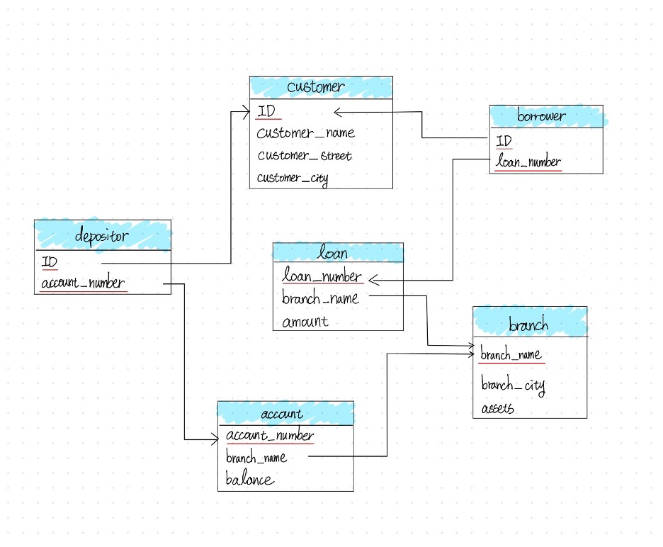

---
project:
  output-dir: docs
title: "Information Management"
format:
  html:
    theme: cosmo
    toc: true
    toc-location: right
    toc-depth: 6
    number-sections: false
    page-layout: full
    smooth-scroll: true
editor: 
  markdown: 
    wrap: 72
---

## Assignments

### Assignment 1

#### Question 1

**Name and describe three applications you have used that employed a
database system to store and access persistent data.** (e.g. airlines,
online trade, banking, university system)

For the first question, one example that comes to mind is video games.
In video games, a player’s level and experience points, as well as the
items and equipment they have obtained, are recorded, so the player can
still access them the next time they log in. Another example is online
shopping. For instance, Amazon records information such as the price of
each product, the catalog it belongs to, whether it is eligible for free
shipping, and whether it is in stock. A third example is a streaming
platform, such as Netflix, which records a user’s region and
subscription level. All of this data is stored persistently and can be
accessed at a later time.

#### Question 2

**Propose three applications in domain projects** (e.g. criminology,
economics, brain science, etc.) Be sure you include: i. Purpose ii.
Functions iii. Simple interface design

##### Wardrobe Management Database

###### i. Purpose

The main purpose of this wardrobe management database is to minimize the
time spent choosing outfits before going out.

For many people, the difficulty in daily outfit selection is not a lack
of clothing, but the need to simultaneously consider colors, styles,
occasions, and overall coordination, which leads to a high
decision-making cost.

Therefore, I model the wardrobe as a relational database, which not only
records individual clothing items but also describes the relationships
between items, allowing outfit selection to be handled in a systematic
way.

By structuring clothing data, this system aims to transform “rethinking
what to wear every day” into “quickly selecting optimal combinations
from a database.”

###### ii. Functions

In this system, each clothing item is treated as a data entity and
described using a set of attributes, such as:

-   category (T-shirts, jeans, outerwear, shoes),
-   color (including the proportion of each color),
-   style (clean-fit, formal, vintage, sports, etc.),
-   material (denim, linen, cotton).

These attributes are normalized into multiple tables, and many-to-many
relationships are used to represent that a single item can belong to
multiple styles or be suitable for different occasions.

The core function of this database is not only to store items, but to
describe the compatibility between items.

The system uses compatibility rules to define:

-   Visual aesthetic constraints, such as avoiding more than three
    colors in a single outfit and limiting the number of style tags to
    maintain overall consistency
-   Climate adaptability, where combinations are evaluated based on
    insulation-related variables to ensure balanced warmth between upper
    and lower body layers, and higher overall insulation is preferred as
    the temperature decreases

When a user selects a specific item (for example, a pink T-shirt), the
system can immediately recommend other highly compatible items (such as
light blue jeans and white sneakers) based on database relationships and
rules, and rank these combinations by compatibility score to help the
user make decisions more efficiently.

In addition, as data accumulates, the system can analyze the overall
structure of the wardrobe, such as:

-   Whether certain styles or clothing categories are lacking
-   Whether colors or item types are overly concentrated
-   Whether newly purchased items overlap in function with existing ones
-   Which older items have not been used for a long time and could be
    considered for removal

This allows the wardrobe to function not just as an item list, but as a
system that can be queried, analyzed, and optimized, and that can be
extended to daily life applications such as outfit recommendations and
purchase decision support.

This problem is particularly well suited for a relational database,
because outfit selection inherently involves structured data and
many-to-many relationships (such as items, styles, and compatibility
rules), which can be efficiently combined and analyzed through
relational queries.

###### iii. Simple interface design

When users enter the system, the home page displays a table view of all
items in the wardrobe, including basic information such as category,
color, style, material, and seasonality. The interface supports
multi-select functionality.

Users can select one or more items they plan to wear and submit their
selection to generate outfit results.

Based on the selected items and the compatibility rules stored in the
database, the system generates multiple outfit candidates.

The outfit results page provides different sorting options, such as
sorting by comfort score, aesthetic score, or climate fit score.

Each outfit displays its corresponding numerical scores, allowing users
to quickly compare options and select the most suitable combination
without repeatedly trying on clothes or overthinking the decision.

The interface supports fast decision-making: select items → generate
outfits → sort by scores → pick the best match.

##### 3D Printing Farm Order & Scheduling Database

###### i. Purpose

The purpose of this 3D printing farm database is to systematize the
entire workflow—from customer order intake to automated estimation,
machine scheduling, and progress tracking—so the farm can operate
efficiently as order volume grows. The goals are to shorten turnaround
time, reduce human scheduling errors, improve machine utilization, and
maximize profitability.

In practice, 3D printing orders vary widely (model size, material,
resolution, multi-color requirements, and post-processing such as
painting). If pricing and scheduling rely on manual judgment, it is easy
to underestimate time/cost, assign the wrong machine, or create
bottlenecks in the order queue. Therefore, this system uses a relational
database to store orders, machine capabilities, material usage, and
scheduling states in a structured way, enabling fast and consistent
decisions through rules and queries.

###### ii. Functions

**Order intake & requirement tagging** (Order Intake & Requirement
Tagging)

When a customer submits an order, the system stores it as an order
record with structured attributes, such as:

-   Model size and volume (bounding box / volume)
-   Printing type (FDM / SLA)
-   Resolution settings (layer height / resolution)
-   Multi-color requirement (multi-color)
-   Material type (material type)
-   Post-processing needs (post-processing, e.g., painting/sanding)
-   Other customization requests (stored as tags)

These fields can be normalized into multiple tables, with many-to-many
relationships used to represent that a single order can have multiple
requirement tags.

**Per-machine estimation** (Per-Machine Estimation)

The key is not only to calculate an overall price for the order, but to
estimate how the same order would perform on different machines, since
time, cost, and completion time may vary by machine. This supports
better machine assignment and scheduling decisions.

For each candidate machine, the system applies pricing rules or an
estimation model to perform per-machine estimation, including:

-   Estimated print time (estimated print time)
-   Estimated material usage (estimated material usage)
-   Machine-specific estimated cost & quote (machine-specific estimated
    cost & quote)
-   Estimated completion time (estimated completion time, considering
    current workload)

The system stores these “order × machine” estimates for querying and
ranking using different objective functions, such as lowest cost,
earliest completion, or the most stable option within a deadline.

**Order queue & status tracking** (Order Queue & Status Tracking)

All orders are automatically added to an order queue (order list), and
each order maintains a clear status, such as:

-   pending
-   queued
-   printing
-   post-processing
-   completed
-   failed

Managers can query:

-   What is currently in the queue and its priority
-   Which orders are printing vs. waiting for machines
-   Which failed orders require reprinting or manual intervention

**Machine capability modeling & assignment recommendations** (Machine
Capability & Assignment)

The database stores each machine’s capabilities and constraints, such
as: - Machine type: multi-color / single-color / SLA / FDM - Maximum
build volume (max build volume) - Supported materials (supported
materials) - Speed/quality profile (speed/quality profile) - Current
workload and availability (workload & availability)

When a new order arrives, the system first performs constraint filtering
(e.g., size, material, multi-color requirements) to identify feasible
machines, then uses per-machine estimation to generate recommended
assignments, for example:

-   Earliest completion time (earliest completion time)
-   Lowest estimated cost (lowest estimated cost)
-   Balanced option (deadline + stability)

This turns scheduling into a decision-support process rather than manual
guesswork.

###### iii. Simple interface design

On the customer side, the system provides a customer order page where
users can upload a 3D model or specify printing requirements such as
size, material, resolution, multi-color options, and post-processing
needs. Based on this information, the system automatically returns an
estimated price and an estimated delivery time.

On the admin side, the system offers an order dashboard that displays
the current order queue and order statuses. Administrators can sort or
filter orders by deadline, priority, or processing status to manage
workflow more efficiently.

The system also includes a machine dashboard that lists all available
machines along with their machine type, maximum build volume, supported
materials, current workload, and estimated availability. This allows
operators to quickly understand machine capacity and constraints.

When an order is selected, the scheduling view presents a list of
candidate machines that can fulfill the order. For each candidate
machine, the system displays the estimated print time, estimated
material usage, machine-specific cost and quote, and estimated
completion time. The interface supports one-click sorting options, such
as fastest, cheapest, or most stable, to assist administrators in making
assignment decisions.

The interface supports efficient operations: submit order → per-machine
estimation → queue order → recommend machines → schedule & track
progress.

##### Wardrobe Management Database

###### i. Purpose

The purpose of this system is to manage the core information of a
farm—such as fields, crop types, growth stages, and irrigation
equipment—using a relational database.

At the same time, the system retrieves and stores weather data through
APIs provided by weather forecast services, and combines this
information with a set of irrigation rules to automatically generate a
daily irrigation schedule.

The goal is to reduce manual decision-making costs while improving
water-use efficiency and consistency in crop management.

###### ii. Functions

In this system, the database is not used only for data storage. Its core
function is to integrate internal farm information with external weather
data and automatically generate irrigation decisions based on predefined
rules.

**Core Data Management**

The system uses a relational schema to manage the main entities of the
farm, including:

-   Field: field ID, location, area, and the crop currently planted
-   Crop: crop type and its basic water requirements
-   Growth Stage: stages such as germination, growth, flowering, and
    fruiting, each with different water needs
-   Irrigation Equipment: equipment type (e.g., drip irrigation,
    sprinkler), flow rate or efficiency factor, and availability status

These entities are connected through relationships. For example, each
field is associated with a specific crop and a current growth stage, and
can be assigned available irrigation equipment.

**Weather Data Integration**

The system retrieves weather information through external weather
forecast APIs, such as:

-   Predicted rainfall amount
-   Probability of precipitation
-   Temperature range

This weather data is stored in the database and used as an important
input for daily irrigation decisions, without requiring manual input
from users.

**Irrigation Rules and Schedule Generation**

The system maintains a set of irrigation rules that describe irrigation
requirements under different conditions, such as:

-   Crop type × growth stage → recommended baseline irrigation amount
-   If predicted rainfall exceeds a certain threshold → automatically
    reduce or cancel irrigation for the day
-   Differences in irrigation equipment efficiency → adjust actual
    irrigation duration

When the daily scheduling process runs, the system combines:

-   The crop type and growth stage of each field
-   The weather forecast for the day
-   The availability and efficiency of irrigation equipment

Based on this information, the system automatically generates a daily
irrigation schedule, indicating whether each field requires irrigation
and the recommended water amount or irrigation time.

###### iii. Simple interface design

When users enter the system, the home page displays a table view of all
fields on the farm, including the current crop type, growth stage, and
the system’s irrigation recommendation for the day.

Users can generate the daily irrigation schedule with a single action.
Based on field information, weather forecasts, and irrigation rules, the
system lists which fields require irrigation and provides recommended
water amounts or irrigation durations.

The schedule is presented in a simple list format, allowing users to
quickly review and execute irrigation tasks. After completion, users can
mark irrigation status for record-keeping and future reference.

#### Question 5

**What are the things current database system cannot do?**

Current database systems are not capable of understanding the semantics
behind data. As a result, in more complex applications, they often rely
on manually defined rules or continuously adjusted weights to produce
reasonable outputs. In addition, databases are limited in handling
cross-context decision-making, where multiple competing objectives must
be balanced simultaneously.

For example, in a wardrobe management database, the system can evaluate
outfits based on structured criteria such as color combinations, style
tags, material properties, and weather conditions. It can assign scores
for factors like aesthetic quality, comfort, and climate suitability,
and generate multiple candidate outfits that satisfy predefined rules.
However, the database cannot determine which outfit represents the
optimal balance among being visually appealing, comfortable, and
suitable for the weather.

This limitation arises because preferences such as “looking good” or
“feeling comfortable” are inherently subjective and context-dependent,
and there is no single optimal solution that applies to all users or
situations. Therefore, the role of the database is not to make the final
decision, but to support decision-making by filtering infeasible
options, structuring relevant information, and presenting comparable
alternatives with transparent evaluation metrics.

Ultimately, the final choice must be made by the user, who can decide
whether to prioritize comfort, aesthetics, or climate suitability in a
given context. This highlights a fundamental limitation of current
database systems: they are effective at decision support, but they
cannot replace human judgment in complex, value-driven decisions.

#### Question 6

**Describe at least three tables that might be used to store information
in a social-network/social media system such as Twitter or Reddit.**

A social-network or social media system such as Twitter or Reddit may be
supported by at least the following three core tables:

**1. User Table**

The user table stores basic information about users, such as: -
user_id - username - account creation time - profile metadata (e.g., bio
or status)

This table represents the identities of users and serves as a reference
for other tables in the system.

**2. Post Table**

The post table stores content created by users, such as:

-   post_id
-   author_id (foreign key referencing the User table)
-   content
-   timestamp

Each post is associated with a specific user, forming a one-to-many
relationship between users and posts.

**3. Comment Table**

The comment table stores replies to posts (or other comments), such as:

-   comment_id
-   post_id (foreign key referencing the Post table)
-   author_id
-   content
-   timestamp

This table supports threaded discussions and allows multiple users to
participate in conversations under the same post.

These tables are separated to support relational queries, maintain data
consistency, and enable efficient retrieval of users, posts, and
discussion threads.

### Assignment 2

#### Question 1

**What are the differences between *relation schema*, *relation*, and
*instance*? Give an example using the university database to
illustrate.**

-   **Relation Schema** = The logical structure of a relation: a list of
    attribute names and their domains. It does not change over time.\
    *Example:* `instructor(ID, name, dept_name, salary)`

-   **Relation** = Informally used to refer to both the schema and
    instance together.\
    *Example:* "The department relation" can refer to either the schema
    `department(dept_name, building, budget)` or the actual data it
    currently holds.

-   **Instance** = A snapshot of the actual data in a relation at a
    given point in time. It changes as tuples are inserted, updated, or
    deleted.\
    *Example:* The department relation instance in Figure 2.5 contains 7
    tuples. If the university adds a "Data Science" department, the
    instance grows to 8 tuples, but the schema remains
    `department(dept_name, building, budget)`.

#### Question 2 & 3

**Draw a schema diagram for the following bank database. Identify
primary keys (underlined) and foreign keys.**

The bank database consists of the following relations:

-   `branch(branch_name, branch_city, assets)`
-   `customer(ID, customer_name, customer_street, customer_city)`
-   `loan(loan_number, branch_name, amount)`
-   `borrower(ID, loan_number)`
-   `account(account_number, branch_name, balance)`
-   `depositor(ID, account_number)`

{width="80%"}

#### Question 4

**Describe two ways artificial intelligence or LLM can assist in
managing or querying a database. In your answer, briefly explain how
each method improves efficiency or accuracy compared to traditional
(non-AI) approaches. (3--5 sentences)**

1.  **Natural Language to SQL (Querying):** LLMs can translate plain
    language questions directly into executable SQL queries, lowering the
    barrier for non-technical users and reducing syntax errors compared
    to writing SQL manually.

2.  **AI-Driven Database Tuning (Managing):** LLMs can automatically
    analyze slow queries and recommend index optimizations, replacing
    the traditionally time-consuming process of a DBA manually examining
    query logs and execution plans.

Overall, both approaches reduce the need for specialized expertise and
allow faster, more accurate database operations compared to traditional
manual methods.

### Assignment 3

#### Question 1

Open the Online SQL interpreter and load the university database.

#### Question 2

**Write SQL codes to get a list of: i. Student IDs, ii. Instructors,
iii. Departments**

{width="80%"}

#### Question 3

**Write SQL codes to do the following queries:**

**i. Find the ID and name of each student who has taken at least one
Comp. Sci. course; make sure there are no duplicate names in the
result.**

{width="80%"}

**ii. Add grades to the list**

{width="80%"}

**iii. Find the ID and name of each student who has not taken any course
offered before 2017.**

{width="80%"}

**iv. For each department, find the maximum salary of instructors in
that department.**

{width="80%"}

**v. Find the lowest, across all departments, of the per-department
maximum salary computed by the preceding query.**

{width="80%"}

**vi. Add names to the list**

{width="80%"}

#### Question 4

**Find instructor (with name and ID) who has never given an A grade in
any course she or he has taught. (Instructors who have never taught a
course trivially satisfy this condition.)**

{width="80%"}

### Assignment 4

#### Question 1

**Explain the difference between a weak entity set and a strong entity
set. Use an example other than the one in Chapter 6 to illustrate.**
(Consult Ch. 6, 6.5.3)

A **strong entity set** is an entity set that has a primary key of its
own and can exist independently. For example, an `Order` entity with
`order_id` as its primary key can uniquely identify each order without
relying on any other entity.

A **weak entity set** is an entity set that does not have a sufficient
set of attributes to form a primary key on its own. Instead, it depends
on a related strong entity set (called the **identifying entity set**)
for its identification. A weak entity set uses a **discriminator**
(also called a partial key) that, when combined with the primary key of
the identifying entity, uniquely identifies each entity in the weak set.

**Example: Order and Order Item**

Consider an e-commerce system:

-   `Order` is a **strong entity set** with primary key `order_id`.
-   `Order_Item` is a **weak entity set** with discriminator
    `item_number`.

An `Order_Item` cannot be uniquely identified by `item_number` alone,
because "item number 3" is meaningless without knowing which order it
belongs to. The full identification requires: `order_id` (from the
identifying entity `Order`) + `item_number` (the discriminator).

The relationship between `Order` and `Order_Item` is an **identifying
relationship**, which means the existence of an `Order_Item` depends
entirely on the existence of its associated `Order`.

**E-R Diagram Notation:**

-   Weak entity set: drawn with a **double-border rectangle**
-   Discriminator: marked with a **dashed underline**
-   Identifying relationship: drawn with a **double-border diamond**
-   The connection from the weak entity to the identifying relationship
    uses a **double line** (total participation), because every weak
    entity must be associated with an identifying entity

#### Question 2

**Design an E-R diagram for keeping track of the scoring statistics of
your favorite sports team.** You should store the matches played, the
scores in each match, the players in each match, and individual player
scoring statistics for each match. Summary statistics should be modeled
as derived attributes with an explanation as to how they are computed.

**a) E-R diagram for a single team (Liverpool FC)**

The diagram models two entities: `match` and `player`, connected by a
many-to-many relationship `played`. The relationship attributes
`points_scored`, `minutes_played`, and `starter_flag` record individual
player statistics for each match. Derived attributes on `player` include
`total_points()` and `avg_points_per_match()`.

{width="80%"}

**Derived attribute definitions:**

-   `total_points()` = sum(points_scored) across all matches
-   `avg_points_per_match()` = total_points / matches_played

**b) Expanded to all teams in the league**

A `team` entity is added with attributes `team_id`, `team_name`, `city`,
and derived attribute `win_count()`. Two new relationships connect
`team` to `match`: `home_team` and `away_team`. A `belongs_to`
relationship connects `player` to `team` (N:1). The `match` entity is
updated with `home_team_score`, `away_team_score`, and derived attribute
`winner()`.

{width="80%"}

**Additional derived attribute definitions:**

-   `win_count()` = count of matches won by the team
-   `winner()` = team with higher score

#### Question 3

##### 3a

**Consider the following query:**

```sql
select course_id, semester, year, sec_id, avg (tot_cred)
from takes natural join student
where year = 2017
group by course_id, semester, year, sec_id
having count (ID) >= 2;
```

**i. Explain why appending `natural join section` in the `from` clause
would not change the result.**

The relation `takes` already contains the attributes `(course_id,
sec_id, semester, year)`, which together form the primary key of the
`section` relation. Because of the foreign key constraint from `takes`
to `section`, every tuple in `takes` is guaranteed to have a matching
tuple in `section`.

Therefore, adding `natural join section` to the `from` clause is a
**lossless join**:

-   **No rows are added**, because each tuple in `takes` matches at
    most one tuple in `section` (since the join is on the primary key of
    `section`).
-   **No rows are removed**, because every tuple in `takes` has a
    corresponding tuple in `section` (due to the foreign key
    constraint).

The only effect of the additional join is that extra attributes from
`section` (such as `building`, `room_number`, and `time_slot_id`) are
appended to each tuple. However, since these attributes do not appear in
the `select`, `where`, `group by`, or `having` clauses, they have no
impact on the query result. The output remains identical.

**ii. Test the results using the Online SQL interpreter.**

Without `natural join section`:

{width="80%"}

With `natural join section` appended:

{width="80%"}

Both queries return identical results (CS-101, CS-190, CS-347), confirming
that appending `natural join section` does not change the output.

##### 3b

**Write an SQL query using the university schema to find the ID of each
student who has never taken a course at the university. Do this using no
subqueries and no set operations (use an outer join).** (Consult Ch. 4,
4.1.3)

```sql
select s.ID
from student s
left outer join takes t on s.ID = t.ID
where t.ID is null;
```

The `left outer join` preserves every tuple from the `student` relation.
For students who have no matching record in `takes` (i.e., they have
never enrolled in any course), all attributes from `takes` are filled
with `null`. The `where t.ID is null` condition filters the result to
include only those students whose `ID` has no match in `takes`, meaning
they have never taken any course.

This approach avoids subqueries and set operations by leveraging the
property of outer joins: unmatched rows from the preserved (left) side
produce `null` values on the non-preserved (right) side, which can then
be detected with an `is null` test.

{width="80%"}

## Final Project

### Weather- and Occasion-Aware Wardrobe Database with Rule-Based Outfit Recommendation

#### Project Overview

A single-user wardrobe management system. Each morning, the system reads the user's
calendar (to determine the occasion) and the current weather, filters out unwearable items
(dirty or archived), and ranks candidate outfits using a rule-based scoring engine built on
color theory, fabric compatibility, and style coherence. The output is the best recommended
outfit plus 3–5 ranked alternatives, each with a score and explanation.

**Core workflow:** Wake up → Read calendar (occasion) + weather → Filter wearable items
→ Score outfit combinations → Output recommendation

**Three scoring dimensions:**

-   **Color** — 60/30/10 color theory; each item carries a `primary / secondary / accent`
    color role
-   **Fabric** — same-fabric bonus, mixed-fabric reasonableness, warmth adequacy relative
    to weather
-   **Style** — style-tag consistency across items, and style–occasion fit scores

#### Database Tables

##### Reference Tables

| Table | Key Columns | Description |
|-------|-------------|-------------|
| `User` | `user_id` PK, `name` | Stores user identity |
| `Category` | `category_id` PK, `name` | Clothing categories: top, bottom, shoes, outerwear, accessory |
| `Color` | `color_id` PK, `name` | Color names (black, white, navy, grey, beige…) |
| `Fabric` | `fabric_id` PK, `name`, `warmth_weight`, `breathability` | Fabric type with warmth (0–100) and breathability (0–100) ratings |
| `StyleTag` | `style_id` PK, `name` | Style labels: street, formal, clean fit, simple, blokecore... |
| `Occasion` | `occasion_id` PK, `name`, `target_formality_min`, `target_formality_max` | Occasion with required formality range |

##### Style & Calendar

| Table | Key Columns | Description |
|-------|-------------|-------------|
| `StyleOccasionFit` | `style_id` FK, `occasion_id` FK, `fit_score` | Fit score (0–100) between a style and an occasion (PK: style_id + occasion_id) |
| `CalendarEvent` | `event_id` PK, `user_id` FK, `occasion_id` FK, `event_date`, `start_time` | Calendar entry mapped to an occasion; drives automatic occasion detection |

##### Clothing Item & Tags

| Table | Key Columns | Description |
|-------|-------------|-------------|
| `ClothingItem` | `item_id` PK, `user_id` FK, `category_id` FK, `fabric_id` FK, `formality_score`, `warmth_score`, `clean_score`, `status` | Main clothing table; recommendable only if `clean_score > 0` and `status = 'active'` |
| `ItemStyle` | `item_id` FK, `style_id` FK | Many-to-many: clothing item to style tags |
| `ItemColor` | `item_id` FK, `color_id` FK, `role` (primary/secondary/accent) | Color role assignment per item; max 3 colors per item |

##### Weather

| Table | Key Columns | Description |
|-------|-------------|-------------|
| `WeatherSnapshot` | `weather_id` PK, `location`, `temp_c`, `feels_like_c`, `humidity`, `wind_speed`, `precip_mm` | Real-time weather data snapshot |
| `WeatherCondition` | `condition_id` PK, `name`, temp/precip/wind/humidity ranges | Named weather condition (e.g. cold_rainy, hot_humid) used for rule matching |

##### Outfit

| Table | Key Columns | Description |
|-------|-------------|-------------|
| `Outfit` | `outfit_id` PK, `user_id` FK, `occasion_id` FK, `weather_id` FK, `total_score`, `explanation` | Generated outfit with total score and explanation |
| `OutfitItem` | PK(outfit_id, slot, layer_order), `item_id` FK | Outfit detail; supports multi-layer dressing within the same slot |

##### Scoring Rules

| Table | Key Columns | Description |
|-------|-------------|-------------|
| `OutfitScoringRule` | `score_rule_id` PK, `rule_type`, `score_delta`, `condition_json`, `valid_from`, `valid_until` | Scoring rule with optional expiry date to support trend-based rules |
| `WearDegradeRule` | `degrade_rule_id` PK, `category_id` FK, `occasion_id` FK (nullable), `condition_id` FK (nullable), `delta_clean_score` | Clean score deduction rule; multiple matching rules are stacked per wear event |

##### Wear Tracking & Laundry

| Table | Key Columns | Description |
|-------|-------------|-------------|
| `WearEvent` | `event_id` PK, `user_id` FK, `outfit_id` FK, `occasion_id` FK, `weather_id` FK, `worn_at` | Records each time an outfit is worn |
| `WearEventItem` | PK(event_id, item_id), `delta_applied`, `clean_score_after` | Per-item deduction detail and resulting clean score after wear |
| `LaundryBatch` | `batch_id` PK, `user_id` FK, `laundry_type` (dark/light) | Laundry batch grouped by color type |
| `LaundryBatchItem` | PK(batch_id, item_id), `reset_to_score` = 100 | Resets clean score to 100 upon laundering |
