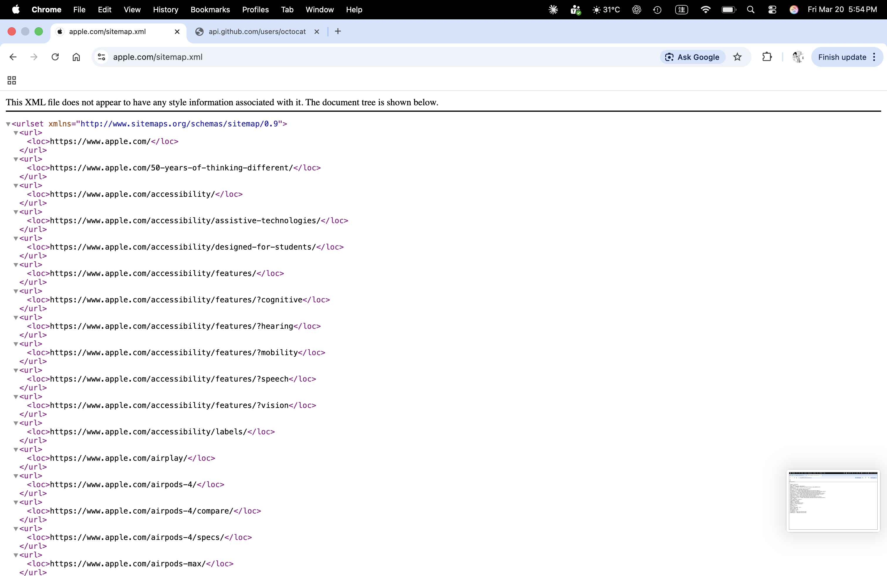

---
project:
  output-dir: docs
title: "Information Management"
format:
  html:
    theme: cosmo
    toc: true
    toc-location: right
    toc-depth: 6
    number-sections: false
    page-layout: full
    smooth-scroll: true
editor: 
  markdown: 
    wrap: 72
---

## Assignments

### Assignment 1

#### Question 1

**Name and describe three applications you have used that employed a
database system to store and access persistent data.** (e.g. airlines,
online trade, banking, university system)

For the first question, one example that comes to mind is video games.
In video games, a player’s level and experience points, as well as the
items and equipment they have obtained, are recorded, so the player can
still access them the next time they log in. Another example is online
shopping. For instance, Amazon records information such as the price of
each product, the catalog it belongs to, whether it is eligible for free
shipping, and whether it is in stock. A third example is a streaming
platform, such as Netflix, which records a user’s region and
subscription level. All of this data is stored persistently and can be
accessed at a later time.

#### Question 2

**Propose three applications in domain projects** (e.g. criminology,
economics, brain science, etc.) Be sure you include: i. Purpose ii.
Functions iii. Simple interface design

##### Wardrobe Management Database

###### i. Purpose

The main purpose of this wardrobe management database is to minimize the
time spent choosing outfits before going out.

For many people, the difficulty in daily outfit selection is not a lack
of clothing, but the need to simultaneously consider colors, styles,
occasions, and overall coordination, which leads to a high
decision-making cost.

Therefore, I model the wardrobe as a relational database, which not only
records individual clothing items but also describes the relationships
between items, allowing outfit selection to be handled in a systematic
way.

By structuring clothing data, this system aims to transform “rethinking
what to wear every day” into “quickly selecting optimal combinations
from a database.”

###### ii. Functions

In this system, each clothing item is treated as a data entity and
described using a set of attributes, such as:

-   category (T-shirts, jeans, outerwear, shoes),
-   color (including the proportion of each color),
-   style (clean-fit, formal, vintage, sports, etc.),
-   material (denim, linen, cotton).

These attributes are normalized into multiple tables, and many-to-many
relationships are used to represent that a single item can belong to
multiple styles or be suitable for different occasions.

The core function of this database is not only to store items, but to
describe the compatibility between items.

The system uses compatibility rules to define:

-   Visual aesthetic constraints, such as avoiding more than three
    colors in a single outfit and limiting the number of style tags to
    maintain overall consistency
-   Climate adaptability, where combinations are evaluated based on
    insulation-related variables to ensure balanced warmth between upper
    and lower body layers, and higher overall insulation is preferred as
    the temperature decreases

When a user selects a specific item (for example, a pink T-shirt), the
system can immediately recommend other highly compatible items (such as
light blue jeans and white sneakers) based on database relationships and
rules, and rank these combinations by compatibility score to help the
user make decisions more efficiently.

In addition, as data accumulates, the system can analyze the overall
structure of the wardrobe, such as:

-   Whether certain styles or clothing categories are lacking
-   Whether colors or item types are overly concentrated
-   Whether newly purchased items overlap in function with existing ones
-   Which older items have not been used for a long time and could be
    considered for removal

This allows the wardrobe to function not just as an item list, but as a
system that can be queried, analyzed, and optimized, and that can be
extended to daily life applications such as outfit recommendations and
purchase decision support.

This problem is particularly well suited for a relational database,
because outfit selection inherently involves structured data and
many-to-many relationships (such as items, styles, and compatibility
rules), which can be efficiently combined and analyzed through
relational queries.

###### iii. Simple interface design

When users enter the system, the home page displays a table view of all
items in the wardrobe, including basic information such as category,
color, style, material, and seasonality. The interface supports
multi-select functionality.

Users can select one or more items they plan to wear and submit their
selection to generate outfit results.

Based on the selected items and the compatibility rules stored in the
database, the system generates multiple outfit candidates.

The outfit results page provides different sorting options, such as
sorting by comfort score, aesthetic score, or climate fit score.

Each outfit displays its corresponding numerical scores, allowing users
to quickly compare options and select the most suitable combination
without repeatedly trying on clothes or overthinking the decision.

The interface supports fast decision-making: select items → generate
outfits → sort by scores → pick the best match.

##### 3D Printing Farm Order & Scheduling Database

###### i. Purpose

The purpose of this 3D printing farm database is to systematize the
entire workflow—from customer order intake to automated estimation,
machine scheduling, and progress tracking—so the farm can operate
efficiently as order volume grows. The goals are to shorten turnaround
time, reduce human scheduling errors, improve machine utilization, and
maximize profitability.

In practice, 3D printing orders vary widely (model size, material,
resolution, multi-color requirements, and post-processing such as
painting). If pricing and scheduling rely on manual judgment, it is easy
to underestimate time/cost, assign the wrong machine, or create
bottlenecks in the order queue. Therefore, this system uses a relational
database to store orders, machine capabilities, material usage, and
scheduling states in a structured way, enabling fast and consistent
decisions through rules and queries.

###### ii. Functions

**Order intake & requirement tagging** (Order Intake & Requirement
Tagging)

When a customer submits an order, the system stores it as an order
record with structured attributes, such as:

-   Model size and volume (bounding box / volume)
-   Printing type (FDM / SLA)
-   Resolution settings (layer height / resolution)
-   Multi-color requirement (multi-color)
-   Material type (material type)
-   Post-processing needs (post-processing, e.g., painting/sanding)
-   Other customization requests (stored as tags)

These fields can be normalized into multiple tables, with many-to-many
relationships used to represent that a single order can have multiple
requirement tags.

**Per-machine estimation** (Per-Machine Estimation)

The key is not only to calculate an overall price for the order, but to
estimate how the same order would perform on different machines, since
time, cost, and completion time may vary by machine. This supports
better machine assignment and scheduling decisions.

For each candidate machine, the system applies pricing rules or an
estimation model to perform per-machine estimation, including:

-   Estimated print time (estimated print time)
-   Estimated material usage (estimated material usage)
-   Machine-specific estimated cost & quote (machine-specific estimated
    cost & quote)
-   Estimated completion time (estimated completion time, considering
    current workload)

The system stores these “order × machine” estimates for querying and
ranking using different objective functions, such as lowest cost,
earliest completion, or the most stable option within a deadline.

**Order queue & status tracking** (Order Queue & Status Tracking)

All orders are automatically added to an order queue (order list), and
each order maintains a clear status, such as:

-   pending
-   queued
-   printing
-   post-processing
-   completed
-   failed

Managers can query:

-   What is currently in the queue and its priority
-   Which orders are printing vs. waiting for machines
-   Which failed orders require reprinting or manual intervention

**Machine capability modeling & assignment recommendations** (Machine
Capability & Assignment)

The database stores each machine’s capabilities and constraints, such
as: - Machine type: multi-color / single-color / SLA / FDM - Maximum
build volume (max build volume) - Supported materials (supported
materials) - Speed/quality profile (speed/quality profile) - Current
workload and availability (workload & availability)

When a new order arrives, the system first performs constraint filtering
(e.g., size, material, multi-color requirements) to identify feasible
machines, then uses per-machine estimation to generate recommended
assignments, for example:

-   Earliest completion time (earliest completion time)
-   Lowest estimated cost (lowest estimated cost)
-   Balanced option (deadline + stability)

This turns scheduling into a decision-support process rather than manual
guesswork.

###### iii. Simple interface design

On the customer side, the system provides a customer order page where
users can upload a 3D model or specify printing requirements such as
size, material, resolution, multi-color options, and post-processing
needs. Based on this information, the system automatically returns an
estimated price and an estimated delivery time.

On the admin side, the system offers an order dashboard that displays
the current order queue and order statuses. Administrators can sort or
filter orders by deadline, priority, or processing status to manage
workflow more efficiently.

The system also includes a machine dashboard that lists all available
machines along with their machine type, maximum build volume, supported
materials, current workload, and estimated availability. This allows
operators to quickly understand machine capacity and constraints.

When an order is selected, the scheduling view presents a list of
candidate machines that can fulfill the order. For each candidate
machine, the system displays the estimated print time, estimated
material usage, machine-specific cost and quote, and estimated
completion time. The interface supports one-click sorting options, such
as fastest, cheapest, or most stable, to assist administrators in making
assignment decisions.

The interface supports efficient operations: submit order → per-machine
estimation → queue order → recommend machines → schedule & track
progress.

##### Wardrobe Management Database

###### i. Purpose

The purpose of this system is to manage the core information of a
farm—such as fields, crop types, growth stages, and irrigation
equipment—using a relational database.

At the same time, the system retrieves and stores weather data through
APIs provided by weather forecast services, and combines this
information with a set of irrigation rules to automatically generate a
daily irrigation schedule.

The goal is to reduce manual decision-making costs while improving
water-use efficiency and consistency in crop management.

###### ii. Functions

In this system, the database is not used only for data storage. Its core
function is to integrate internal farm information with external weather
data and automatically generate irrigation decisions based on predefined
rules.

**Core Data Management**

The system uses a relational schema to manage the main entities of the
farm, including:

-   Field: field ID, location, area, and the crop currently planted
-   Crop: crop type and its basic water requirements
-   Growth Stage: stages such as germination, growth, flowering, and
    fruiting, each with different water needs
-   Irrigation Equipment: equipment type (e.g., drip irrigation,
    sprinkler), flow rate or efficiency factor, and availability status

These entities are connected through relationships. For example, each
field is associated with a specific crop and a current growth stage, and
can be assigned available irrigation equipment.

**Weather Data Integration**

The system retrieves weather information through external weather
forecast APIs, such as:

-   Predicted rainfall amount
-   Probability of precipitation
-   Temperature range

This weather data is stored in the database and used as an important
input for daily irrigation decisions, without requiring manual input
from users.

**Irrigation Rules and Schedule Generation**

The system maintains a set of irrigation rules that describe irrigation
requirements under different conditions, such as:

-   Crop type × growth stage → recommended baseline irrigation amount
-   If predicted rainfall exceeds a certain threshold → automatically
    reduce or cancel irrigation for the day
-   Differences in irrigation equipment efficiency → adjust actual
    irrigation duration

When the daily scheduling process runs, the system combines:

-   The crop type and growth stage of each field
-   The weather forecast for the day
-   The availability and efficiency of irrigation equipment

Based on this information, the system automatically generates a daily
irrigation schedule, indicating whether each field requires irrigation
and the recommended water amount or irrigation time.

###### iii. Simple interface design

When users enter the system, the home page displays a table view of all
fields on the farm, including the current crop type, growth stage, and
the system’s irrigation recommendation for the day.

Users can generate the daily irrigation schedule with a single action.
Based on field information, weather forecasts, and irrigation rules, the
system lists which fields require irrigation and provides recommended
water amounts or irrigation durations.

The schedule is presented in a simple list format, allowing users to
quickly review and execute irrigation tasks. After completion, users can
mark irrigation status for record-keeping and future reference.

#### Question 5

**What are the things current database system cannot do?**

Current database systems are not capable of understanding the semantics
behind data. As a result, in more complex applications, they often rely
on manually defined rules or continuously adjusted weights to produce
reasonable outputs. In addition, databases are limited in handling
cross-context decision-making, where multiple competing objectives must
be balanced simultaneously.

For example, in a wardrobe management database, the system can evaluate
outfits based on structured criteria such as color combinations, style
tags, material properties, and weather conditions. It can assign scores
for factors like aesthetic quality, comfort, and climate suitability,
and generate multiple candidate outfits that satisfy predefined rules.
However, the database cannot determine which outfit represents the
optimal balance among being visually appealing, comfortable, and
suitable for the weather.

This limitation arises because preferences such as “looking good” or
“feeling comfortable” are inherently subjective and context-dependent,
and there is no single optimal solution that applies to all users or
situations. Therefore, the role of the database is not to make the final
decision, but to support decision-making by filtering infeasible
options, structuring relevant information, and presenting comparable
alternatives with transparent evaluation metrics.

Ultimately, the final choice must be made by the user, who can decide
whether to prioritize comfort, aesthetics, or climate suitability in a
given context. This highlights a fundamental limitation of current
database systems: they are effective at decision support, but they
cannot replace human judgment in complex, value-driven decisions.

#### Question 6

**Describe at least three tables that might be used to store information
in a social-network/social media system such as Twitter or Reddit.**

A social-network or social media system such as Twitter or Reddit may be
supported by at least the following three core tables:

**1. User Table**

The user table stores basic information about users, such as: -
user_id - username - account creation time - profile metadata (e.g., bio
or status)

This table represents the identities of users and serves as a reference
for other tables in the system.

**2. Post Table**

The post table stores content created by users, such as:

-   post_id
-   author_id (foreign key referencing the User table)
-   content
-   timestamp

Each post is associated with a specific user, forming a one-to-many
relationship between users and posts.

**3. Comment Table**

The comment table stores replies to posts (or other comments), such as:

-   comment_id
-   post_id (foreign key referencing the Post table)
-   author_id
-   content
-   timestamp

This table supports threaded discussions and allows multiple users to
participate in conversations under the same post.

These tables are separated to support relational queries, maintain data
consistency, and enable efficient retrieval of users, posts, and
discussion threads.

### Assignment 2

#### Question 1

**What are the differences between *relation schema*, *relation*, and
*instance*? Give an example using the university database to
illustrate.**

-   **Relation Schema** = The logical structure of a relation: a list of
    attribute names and their domains. It does not change over time.\
    *Example:* `instructor(ID, name, dept_name, salary)`

-   **Relation** = Informally used to refer to both the schema and
    instance together.\
    *Example:* "The department relation" can refer to either the schema
    `department(dept_name, building, budget)` or the actual data it
    currently holds.

-   **Instance** = A snapshot of the actual data in a relation at a
    given point in time. It changes as tuples are inserted, updated, or
    deleted.\
    *Example:* The department relation instance in Figure 2.5 contains 7
    tuples. If the university adds a "Data Science" department, the
    instance grows to 8 tuples, but the schema remains
    `department(dept_name, building, budget)`.

#### Question 2 & 3

**Draw a schema diagram for the following bank database. Identify
primary keys (underlined) and foreign keys.**

The bank database consists of the following relations:

-   `branch(branch_name, branch_city, assets)`
-   `customer(ID, customer_name, customer_street, customer_city)`
-   `loan(loan_number, branch_name, amount)`
-   `borrower(ID, loan_number)`
-   `account(account_number, branch_name, balance)`
-   `depositor(ID, account_number)`

{width="80%"}

#### Question 4

**Describe two ways artificial intelligence or LLM can assist in
managing or querying a database. In your answer, briefly explain how
each method improves efficiency or accuracy compared to traditional
(non-AI) approaches. (3--5 sentences)**

1.  **Natural Language to SQL (Querying):** LLMs can translate plain
    language questions directly into executable SQL queries, lowering the
    barrier for non-technical users and reducing syntax errors compared
    to writing SQL manually.

2.  **AI-Driven Database Tuning (Managing):** LLMs can automatically
    analyze slow queries and recommend index optimizations, replacing
    the traditionally time-consuming process of a DBA manually examining
    query logs and execution plans.

Overall, both approaches reduce the need for specialized expertise and
allow faster, more accurate database operations compared to traditional
manual methods.

### Assignment 3

#### Question 1

Open the Online SQL interpreter and load the university database.

#### Question 2

**Write SQL codes to get a list of: i. Student IDs, ii. Instructors,
iii. Departments**

{width="80%"}

#### Question 3

**Write SQL codes to do the following queries:**

**i. Find the ID and name of each student who has taken at least one
Comp. Sci. course; make sure there are no duplicate names in the
result.**

{width="80%"}

**ii. Add grades to the list**

{width="80%"}

**iii. Find the ID and name of each student who has not taken any course
offered before 2017.**

{width="80%"}

**iv. For each department, find the maximum salary of instructors in
that department.**

{width="80%"}

**v. Find the lowest, across all departments, of the per-department
maximum salary computed by the preceding query.**

{width="80%"}

**vi. Add names to the list**

{width="80%"}

#### Question 4

**Find instructor (with name and ID) who has never given an A grade in
any course she or he has taught. (Instructors who have never taught a
course trivially satisfy this condition.)**

{width="80%"}

### Assignment 4

#### Question 1

**Explain the difference between a weak entity set and a strong entity
set. Use an example other than the one in Chapter 6 to illustrate.**
(Consult Ch. 6, 6.5.3)

A **strong entity set** is an entity set that has a primary key of its
own and can exist independently. For example, an `Order` entity with
`order_id` as its primary key can uniquely identify each order without
relying on any other entity.

A **weak entity set** is an entity set that does not have a sufficient
set of attributes to form a primary key on its own. Instead, it depends
on a related strong entity set (called the **identifying entity set**)
for its identification. A weak entity set uses a **discriminator**
(also called a partial key) that, when combined with the primary key of
the identifying entity, uniquely identifies each entity in the weak set.

**Example: Order and Order Item**

Consider an e-commerce system:

-   `Order` is a **strong entity set** with primary key `order_id`.
-   `Order_Item` is a **weak entity set** with discriminator
    `item_number`.

An `Order_Item` cannot be uniquely identified by `item_number` alone,
because "item number 3" is meaningless without knowing which order it
belongs to. The full identification requires: `order_id` (from the
identifying entity `Order`) + `item_number` (the discriminator).

The relationship between `Order` and `Order_Item` is an **identifying
relationship**, which means the existence of an `Order_Item` depends
entirely on the existence of its associated `Order`.

**E-R Diagram Notation:**

-   Weak entity set: drawn with a **double-border rectangle**
-   Discriminator: marked with a **dashed underline**
-   Identifying relationship: drawn with a **double-border diamond**
-   The connection from the weak entity to the identifying relationship
    uses a **double line** (total participation), because every weak
    entity must be associated with an identifying entity

#### Question 2

**Design an E-R diagram for keeping track of the scoring statistics of
your favorite sports team.** You should store the matches played, the
scores in each match, the players in each match, and individual player
scoring statistics for each match. Summary statistics should be modeled
as derived attributes with an explanation as to how they are computed.

**a) E-R diagram for a single team (Liverpool FC)**

The diagram models two entities: `match` and `player`, connected by a
many-to-many relationship `played`. The relationship attributes
`points_scored`, `minutes_played`, and `starter_flag` record individual
player statistics for each match. Derived attributes on `player` include
`total_points()` and `avg_points_per_match()`.

{width="80%"}

**Derived attribute definitions:**

-   `total_points()` = sum(points_scored) across all matches
-   `avg_points_per_match()` = total_points / matches_played

**b) Expanded to all teams in the league**

A `team` entity is added with attributes `team_id`, `team_name`, `city`,
and derived attribute `win_count()`. Two new relationships connect
`team` to `match`: `home_team` and `away_team`. A `belongs_to`
relationship connects `player` to `team` (N:1). The `match` entity is
updated with `home_team_score`, `away_team_score`, and derived attribute
`winner()`.

{width="80%"}

**Additional derived attribute definitions:**

-   `win_count()` = count of matches won by the team
-   `winner()` = team with higher score

#### Question 3

##### 3a

**Consider the following query:**

```sql
select course_id, semester, year, sec_id, avg (tot_cred)
from takes natural join student
where year = 2017
group by course_id, semester, year, sec_id
having count (ID) >= 2;
```

**i. Explain why appending `natural join section` in the `from` clause
would not change the result.**

The relation `takes` already contains the attributes `(course_id,
sec_id, semester, year)`, which together form the primary key of the
`section` relation. Because of the foreign key constraint from `takes`
to `section`, every tuple in `takes` is guaranteed to have a matching
tuple in `section`.

Therefore, adding `natural join section` to the `from` clause is a
**lossless join**:

-   **No rows are added**, because each tuple in `takes` matches at
    most one tuple in `section` (since the join is on the primary key of
    `section`).
-   **No rows are removed**, because every tuple in `takes` has a
    corresponding tuple in `section` (due to the foreign key
    constraint).

The only effect of the additional join is that extra attributes from
`section` (such as `building`, `room_number`, and `time_slot_id`) are
appended to each tuple. However, since these attributes do not appear in
the `select`, `where`, `group by`, or `having` clauses, they have no
impact on the query result. The output remains identical.

**ii. Test the results using the Online SQL interpreter.**

Without `natural join section`:

{width="80%"}

With `natural join section` appended:

{width="80%"}

Both queries return identical results (CS-101, CS-190, CS-347), confirming
that appending `natural join section` does not change the output.

##### 3b

**Write an SQL query using the university schema to find the ID of each
student who has never taken a course at the university. Do this using no
subqueries and no set operations (use an outer join).** (Consult Ch. 4,
4.1.3)

```sql
select s.ID
from student s
left outer join takes t on s.ID = t.ID
where t.ID is null;
```

The `left outer join` preserves every tuple from the `student` relation.
For students who have no matching record in `takes` (i.e., they have
never enrolled in any course), all attributes from `takes` are filled
with `null`. The `where t.ID is null` condition filters the result to
include only those students whose `ID` has no match in `takes`, meaning
they have never taken any course.

This approach avoids subqueries and set operations by leveraging the
property of outer joins: unmatched rows from the preserved (left) side
produce `null` values on the non-preserved (right) side, which can then
be detected with an `is null` test.

{width="80%"}

### Assignment 5

#### Question 1

**An E-R diagram can be viewed as a graph. What do the following mean
in terms of the structure of an enterprise schema?**

##### a) The graph is disconnected

In graph theory, a disconnected graph means the graph has at least two
connected components — that is, there exist nodes with no path between
them. In the context of an enterprise E-R schema, this means the
diagram contains at least two groups of entity sets and relationship
sets that are **completely independent of each other**, sharing no
relationships, no foreign key references, and no common attributes. In
practice, this implies the schema is modeling two or more entirely
separate business domains with no interaction between them.

##### b) The graph has a cycle

In graph theory, a cycle means there exist two nodes in the graph that
are connected by two or more completely distinct paths. In the context
of an enterprise E-R schema, this means there are **multiple
relationship paths connecting the same set of entity sets**.

However, a cycle does not necessarily imply redundancy. Each path in the
cycle may carry semantically independent information — for example, one
path may capture relationship attributes along the x-dimension and
another along the y-dimension, and neither can be derived from the
other. Whether the cycle represents true redundancy depends entirely on
the semantic constraints of the domain: a relationship is truly
redundant only if its information can be fully derived from the other
paths in the cycle. Therefore, a cycle signals complex
interdependencies in the schema that require careful analysis, but not
automatic redundancy.

#### Question 3

**We can convert any weak entity set to a strong entity set by simply
adding appropriate attributes. Why, then, do we have weak entity
sets?**

Although it is technically possible to convert any weak entity set to a
strong entity set by adding a unique identifier attribute (e.g., a
surrogate key), weak entity sets are still useful and preferred for the
following reasons:

1.  **Semantic Clarity and Modeling Fidelity.** Weak entity sets reflect
    genuine real-world dependencies. For example, a room within a
    building only has meaning relative to the building it belongs to.
    Converting it into a strong entity set by assigning a globally
    unique `room_id` would technically work, but would obscure this
    inherent dependency and make the schema harder to understand.

2.  **Avoiding Meaningless Surrogate Keys.** Creating unique keys for
    entities that have no independent identity — such as order items
    within an order, or a patient's log entries within a hospital —
    forces the introduction of artificial keys that carry no real-world
    meaning. This adds complexity without improving the quality of the
    data model.

3.  **Enforcing Referential Integrity and Existence Dependency.** Weak
    entity sets make existence dependencies explicit in the schema.
    Because a weak entity set can only exist if its identifying (owner)
    entity exists, this constraint is built into the model. If the owner
    entity is deleted, its dependent weak entities are automatically
    considered invalid. This enforces data integrity at the conceptual
    level in a way that a strong entity set with a foreign key
    constraint does not as clearly communicate.

4.  **Reducing Redundancy.** If a weak entity's natural identifier is
    only unique within the context of its owner (e.g., section number
    within a course), using a composite identifier (owner key +
    discriminator) is more compact and meaningful than introducing an
    entirely new global key. It avoids duplicating the owner's key
    information unnecessarily.

In summary, weak entity sets improve the expressiveness and clarity of
the E-R model. They allow designers to accurately represent entities
whose existence and identity are inherently tied to another entity,
leading to schemas that are easier to understand, maintain, and reason
about.

#### Question 4

##### 4a

**Consider the employee database:**

```
employee (ID, person_name, street, city)
works (ID, company_name, salary)
company (company_name, city)
manages (ID, manager_id)
```

**where the primary keys are underlined. Give an expression in SQL for
each of the following queries.**

**i. Find ID and name of each employee who lives in the same city as
the location of the company for which the employee works.**

```sql
SELECT e.ID, e.person_name
FROM employee AS e, works AS w, company AS c
WHERE e.ID = w.ID
  AND w.company_name = c.company_name
  AND e.city = c.city;
```

This query joins `employee` with `works` to link each employee to their
company, then joins with `company` to get the company's city. The
`WHERE` clause then filters for employees whose city matches the city
of their employer.

**ii. Find ID and name of each employee who lives in the same city and
on the same street as does her or his manager.**

```sql
SELECT e.ID, e.person_name
FROM employee AS e, manages AS m, employee AS mgr
WHERE e.ID = m.ID
  AND m.manager_id = mgr.ID
  AND e.city = mgr.city
  AND e.street = mgr.street;
```

This query uses the `manages` table to identify each employee's
manager, then joins `employee` twice — once for the employee (aliased
as `e`) and once for the manager (aliased as `mgr`). The `WHERE` clause
requires both the city and the street to match between the employee and
their manager.

**iii. Find ID and name of each employee who earns more than the
average salary of all employees of her or his company.**

```sql
SELECT e.ID, e.person_name
FROM employee AS e, works AS w
WHERE e.ID = w.ID
  AND w.salary > (
    SELECT AVG(w2.salary)
    FROM works AS w2
    WHERE w2.company_name = w.company_name
  );
```

This query uses a correlated subquery to compute, for each employee,
the average salary of all employees at their company. The outer query
then filters for employees whose salary exceeds this per-company
average. The correlation is established by matching
`w2.company_name = w.company_name`.

##### 4b

**Consider the following SQL query that seeks to find a list of titles
of all courses taught in Spring 2017 along with the name of the
instructor.**

```sql
SELECT name, title
FROM instructor NATURAL JOIN teaches
     NATURAL JOIN section NATURAL JOIN course
WHERE semester = 'Spring' AND year = 2017
```

**What is wrong with this query?**

The problem lies in how `NATURAL JOIN` works: it joins on all columns
that share the same name across the joined relations. In the standard
university schema, the relations have the following attributes:

-   `instructor`(`ID`, `name`, `dept_name`, `salary`)
-   `teaches`(`ID`, `course_id`, `sec_id`, `semester`, `year`)
-   `section`(`course_id`, `sec_id`, `semester`, `year`, `building`,
    `room_number`, `time_slot_id`)
-   `course`(`course_id`, `title`, `dept_name`, `credits`)

When the query performs `instructor NATURAL JOIN teaches`, it correctly
joins on `ID`. When it then joins with `section`, it correctly joins on
`course_id`, `sec_id`, `semester`, `year`. However, when it finally
joins with `course`, both the running result (from `instructor`) and
`course` contain the attribute `dept_name`. The `NATURAL JOIN` therefore
additionally enforces the condition
`instructor.dept_name = course.dept_name`, which incorrectly restricts
the results to only include cases where the instructor belongs to the
same department as the course.

This is incorrect because instructors can — and often do — teach
courses offered by departments other than their own. Those
cross-department teaching assignments would be wrongly excluded from the
query results.

The fix is to replace only the last `NATURAL JOIN course` with an
explicit `JOIN course USING (course_id)`. This ensures that the join
with `course` is performed only on `course_id`, preventing `dept_name`
from being silently included as a join condition:

```sql
SELECT name, title
FROM instructor NATURAL JOIN teaches
     NATURAL JOIN section
     JOIN course USING (course_id)
WHERE semester = 'Spring' AND year = 2017;
```

This version controls exactly which attribute is joined on, preventing
`dept_name` from unintentionally filtering out cross-department teaching
assignments.

### Assignment 6

#### Question 1 — Websites Using JSON and XML

**Look up websites containing the following data representations: a)
Using JSON, b) Using XML. Analyze the websites in terms of structure and
composition. Name the technology/methods use for creating the web
database.**

##### a) JSON Example — GitHub API User Data

**URL:** `https://api.github.com/users/octocat`

This page shows public GitHub user data in JSON format. The data is
returned as a JSON object with many key-value pairs such as `login`,
`id`, `html_url`, `followers`, and `created_at`.

{width="80%"}

**Structure and composition:**

-   The outer structure is a JSON object marked by `{ }`.
-   Each field is stored as a key-value pair, for example
    `"login": "octocat"`.
-   The response contains strings, numbers, URLs, boolean values, and
    null values.
-   This format is lightweight and easy for websites and apps to
    exchange data.

**Possible technologies / methods:**

-   REST API
-   Backend web service
-   Database support such as PostgreSQL, MySQL, or NoSQL systems
-   JSON response for web and application data exchange

##### b) XML Example — Apple Sitemap

**URL:** `https://www.apple.com/sitemap.xml`

This page shows Apple's sitemap in XML format. It lists webpage links so
that search engines can discover and index the site.

{width="80%"}

**Structure and composition:**

-   The root element is `<urlset>`.
-   Each webpage entry is stored inside a repeated `<url>` element.
-   The actual page address is stored inside the `<loc>` tag.
-   The data is organized in a hierarchical tag structure, which is a
    key feature of XML.

**Possible technologies / methods:**

-   XML sitemap standard
-   Website content publishing system or CMS
-   Backend-generated data from a site database
-   Search engine indexing support

##### Quick Comparison

-   JSON is shorter and easier for web APIs and applications.
-   XML uses tags and hierarchy, so it is useful for structured
    documents and sitemaps.
-   Both formats help websites store or exchange data in an organized
    way.

#### Question 2 — SQL Exercises

##### i. Students Without Advisors (Left Outer Join)

**Express the following query in SQL using no subqueries and no set
operations. (Hint: left outer join)**

```sql
select ID
from student
except
select s_id
from advisor
where i_ID is not null
```

**Idea:** Keep all rows from `student` by using `LEFT OUTER JOIN`. Match
`student.ID` with `advisor.s_id`. If a student has no matching advisor
row, then advisor columns become `NULL`. Therefore,
`where a.s_id is null` returns students without advisors.

**SQL answer:**

```sql
select s.ID
from student s
left outer join advisor a
  on s.ID = a.s_id
where a.s_id is null;
```

{width="80%"}

##### ii. Instructors Who Teach Every Course in Their Department

**Using the university schema, write an SQL query to find the names and
IDs of those instructors who teach every course taught in his or her
department (i.e., every course that appears in the *course* relation with
the instructor's department name). Order result by name.**

**Idea:** For each instructor, first limit the scope to courses in the
same department. Then check whether there exists any department course
that the instructor did not teach. If no such course exists, then the
instructor taught every course in the department. This is why the query
uses `NOT EXISTS` with another `NOT EXISTS` inside it.

**SQL answer:**

```sql
select i.name, i.ID
from instructor i
where not exists (
    select *
    from course c
    where c.dept_name = i.dept_name
      and not exists (
          select *
          from teaches t
          where t.ID = i.ID
            and t.course_id = c.course_id
      )
)
order by i.name;
```

{width="80%"}

#### Question 3 — R and PostgreSQL

##### a) Import the Full Database

The university database was created using the DDL (Data Definition
Language) schema and populated with the large relations insert file from
the textbook website.

**DDL schema (`DDL.sql`):**

```sql
create table classroom
    (building       varchar(15),
     room_number    varchar(7),
     capacity       numeric(4,0),
     primary key (building, room_number)
    );

create table department
    (dept_name      varchar(20),
     building       varchar(15),
     budget         numeric(12,2) check (budget > 0),
     primary key (dept_name)
    );

create table course
    (course_id      varchar(8),
     title          varchar(50),
     dept_name      varchar(20),
     credits        numeric(2,0) check (credits > 0),
     primary key (course_id),
     foreign key (dept_name) references department (dept_name)
        on delete set null
    );

create table instructor
    (ID             varchar(5),
     name           varchar(20) not null,
     dept_name      varchar(20),
     salary         numeric(8,2) check (salary > 29000),
     primary key (ID),
     foreign key (dept_name) references department (dept_name)
        on delete set null
    );

create table section
    (course_id      varchar(8),
     sec_id         varchar(8),
     semester       varchar(6)
        check (semester in ('Fall', 'Winter', 'Spring', 'Summer')),
     year           numeric(4,0) check (year > 1701 and year < 2100),
     building       varchar(15),
     room_number    varchar(7),
     time_slot_id   varchar(4),
     primary key (course_id, sec_id, semester, year),
     foreign key (course_id) references course (course_id)
        on delete cascade,
     foreign key (building, room_number) references classroom
        on delete set null
    );

create table teaches
    (ID             varchar(5),
     course_id      varchar(8),
     sec_id         varchar(8),
     semester       varchar(6),
     year           numeric(4,0),
     primary key (ID, course_id, sec_id, semester, year),
     foreign key (course_id, sec_id, semester, year)
        references section on delete cascade,
     foreign key (ID) references instructor (ID)
        on delete cascade
    );

create table student
    (ID             varchar(5),
     name           varchar(20) not null,
     dept_name      varchar(20),
     tot_cred       numeric(3,0) check (tot_cred >= 0),
     primary key (ID),
     foreign key (dept_name) references department (dept_name)
        on delete set null
    );

create table takes
    (ID             varchar(5),
     course_id      varchar(8),
     sec_id         varchar(8),
     semester       varchar(6),
     year           numeric(4,0),
     grade          varchar(2),
     primary key (ID, course_id, sec_id, semester, year),
     foreign key (course_id, sec_id, semester, year)
        references section on delete cascade,
     foreign key (ID) references student (ID)
        on delete cascade
    );

create table advisor
    (s_ID           varchar(5),
     i_ID           varchar(5),
     primary key (s_ID),
     foreign key (i_ID) references instructor (ID)
        on delete set null,
     foreign key (s_ID) references student (ID)
        on delete cascade
    );

create table time_slot
    (time_slot_id   varchar(4),
     day            varchar(1),
     start_hr       numeric(2) check (start_hr >= 0 and start_hr < 24),
     start_min      numeric(2) check (start_min >= 0 and start_min < 60),
     end_hr         numeric(2) check (end_hr >= 0 and end_hr < 24),
     end_min        numeric(2) check (end_min >= 0 and end_min < 60),
     primary key (time_slot_id, day, start_hr, start_min)
    );

create table prereq
    (course_id      varchar(8),
     prereq_id      varchar(8),
     primary key (course_id, prereq_id),
     foreign key (course_id) references course (course_id)
        on delete cascade,
     foreign key (prereq_id) references course (course_id)
    );
```

##### b) Run RPostgres01.R

The R script connects to the local PostgreSQL database using
`RPostgres` and `DBI`, runs three queries, exports a CSV, and
disconnects.

**Load libraries and connect:**

{width="80%"}

**Query (a) — Fetch all instructors:**

{width="80%"}

**Query (b) — Comp. Sci. instructors with salary > 60000:**

{width="80%"}

**Query (c) — Students with tot_cred >= 50:**

{width="80%"}

**Export to CSV and disconnect:**

{width="80%"}

##### c) Results

**R script (`RPostgres01.R`):**

```r
# Connect PostgreSQL database using R
# Packages: DBI, odbc, RPostgres
# Documentation:
## DBI: https://dbi.r-dbi.org
## RPostgres https://github.com/r-dbi/RPostgres
## R https://solutions.posit.co/connections/db/
## odbc: https://solutions.posit.co/connections/db/best-practices/drivers/

install.packages(c("RPostgres", "DBI", "odbc"))

## Load libraries
library(RPostgres)
library(DBI)
library(odbc)

## Connect to PostgreSQL and database
con <- dbConnect(
  RPostgres::Postgres(),
  dbname   = "university",
  host     = "localhost",
  port     = 5432,
  user     = "postgres",
  password = "123489"
)

## Perform queries

# (a) Simple query: fetch all rows/columns in 'instructor'
instructor_data <- dbGetQuery(con, "SELECT * FROM instructor")
head(instructor_data)

# (b) Fetch instructors in 'Comp. Sci.' department with salary > 60000
comp_sci_instructors <- dbGetQuery(
  con,
  "SELECT * FROM instructor
   WHERE dept_name = 'Comp. Sci.' AND salary > 60000;"
)
comp_sci_instructors

# (c) Query 'student' table: students with tot_cred >= 50
student_data <- dbGetQuery(con, "SELECT * FROM student WHERE tot_cred >= 50")
head(student_data)

## Export to CSV
write.csv(instructor_data, file = "instructor_export.csv", row.names = FALSE)

## Clean up
dbDisconnect(con)
```

### Assignment 7 — AI Exercise (Shiny)

Two Shiny apps were built, modified according to the assignment
requirements, and deployed live to **shinyapps.io**. App 1 was
re-engineered from a local PostgreSQL connection to a bundled
**SQLite** database so that it runs fully in the cloud without
requiring the instructor's machine to host a server.

#### App 1 — University Database (SQLite + ggplot2)

**Modifications applied:**

-   **(a) Password / connection.** The original `RPostgres` connection
    to `localhost:5432` was replaced with a file-based SQLite connection:
    `dbConnect(RSQLite::SQLite(), "university.db")`. The
    `university.db` file was built from the textbook's `DDL.sql` and
    `largeRelationsInsertFile.sql` and bundled with the app.
-   **(b) Sort salary high → low.** Changed `reorder(dept_name,
    y_value)` to `reorder(dept_name, -y_value)` so the tallest bar sits
    on the left.
-   **(c) Another variable from another table.** Added a `selectInput`
    dropdown that switches between two queries: average instructor
    salary (table `instructor`) and average student total credits
    (table `student`).

**Live app:** <https://chentzuyuan.shinyapps.io/epps6354-hw7-1/>

<iframe src="https://chentzuyuan.shinyapps.io/epps6354-hw7-1/" width="100%" height="650" style="border:1px solid #ccc; border-radius:8px;" loading="lazy"></iframe>

#### App 2 — Old Faithful Geyser Histogram

**Modification applied:**

-   **(a) Barchart color.** Changed `col = "blue"` to the project's
    global palette — fill `#18A3A380` (teal, `color1`), border
    `#FF4D8DCC` (pink, `color2`) — for consistency with App 1.

**Live app:** <https://chentzuyuan.shinyapps.io/epps6354-hw7-2/>

<iframe src="https://chentzuyuan.shinyapps.io/epps6354-hw7-2/" width="100%" height="550" style="border:1px solid #ccc; border-radius:8px;" loading="lazy"></iframe>

### Assignment 8 — NBA Database Shiny App

Following the workshop at
[datageneration/informationmanagement — workshop/Shiny](https://github.com/datageneration/informationmanagement/tree/master/workshop/Shiny),
the full pipeline was reproduced end-to-end and deployed live to
**shinyapps.io**.

#### a) Build the NBA database on local PostgreSQL

The course-provided `NBAPlayers.sql` file was loaded into a fresh
PostgreSQL 18 database named `NBAplayers`:

```bash
createdb -U postgres NBAplayers
psql -U postgres -d NBAplayers -f NBAPlayers.sql
```

Three tables were populated: `player` (4,501 rows), `player_salary`
(1,292 rows), and `player_photos` (4,593 rows).

#### b) Export into SQLite

Because the SQL file's `CREATE TABLE` syntax is already SQLite-friendly,
the same file was loaded directly into a SQLite database file
`nba.db` — no manual schema translation was needed:

```bash
sqlite3 nba.db < NBAPlayers.sql
```

Row counts in `nba.db` exactly match the PostgreSQL build
(4,501 / 1,292 / 4,593), confirming a clean export.

#### c) Embed in Shiny

The app follows the instructor-provided template structure: a single
slider that controls how many active players to render in a `DT`
DataTable, with each row's headshot embedded as an `` tag.

The query inner-joins `Player` with `Player_Photos` on `idPlayer` and
filters to `is_active = 1`:

```sql
SELECT p.id, p.first_name, p.last_name, p.full_name,
       pp.urlPlayerHeadshot
FROM Player p
INNER JOIN Player_Photos pp ON pp.idPlayer = p.id
WHERE p.is_active = 1
LIMIT <slider_value>;
```

The headshot column is rendered with `escape = FALSE` so the URLs
become inline images:

```r
table_df$headshot <- paste0(
  '</img>'
)
```

The same color palette as Assignment 7 (`#18A3A380` header,
`#FF4D8DCC` border) is applied via custom CSS so the look matches the
rest of the site.

#### d) Deploy on Shinyapps.io

```r
rsconnect::deployApp(
  appDir   = "nba-shiny",
  appName  = "epps6354-hw8-nba",
  appFiles = c("app.R", "nba.db")
)
```

The `nba.db` SQLite file is bundled with the app, so the deployed
instance is fully self-contained — no remote database connection
needed.

**Live app:** <https://chentzuyuan.shinyapps.io/epps6354-hw8-nba/>

<iframe src="https://chentzuyuan.shinyapps.io/epps6354-hw8-nba/" width="100%" height="700" style="border:1px solid #ccc; border-radius:8px;" loading="lazy"></iframe>

## Final Project {#final-project}

```{=html}
<!-- Wake the Render demo as soon as the user lands on this anchor.
     Render's free tier sleeps after 15 min idle and takes ~50 s to
     spin up; firing /healthz now means the container is usually ready
     by the time the visitor clicks through to closetmind.html. -->
<link rel="preconnect" href="https://closetmind.onrender.com">
<link rel="dns-prefetch" href="https://closetmind.onrender.com">
<script>
  // No-cors fetch is enough to trigger Render's wake-up signal; we
  // don't need the response body. Fire-and-forget.
  if (typeof fetch === "function") {
    try { fetch("https://closetmind.onrender.com/healthz", {mode: "no-cors", cache: "no-store"}); } catch (_) {}
  }
</script>
```

### ClosetMind &mdash; Wardrobe Recommendation System

::: {.callout-tip}
**Live demo:** [Try the desktop app &rarr;](closetmind.html)
&middot; [Download macOS DMG](https://github.com/chentzuyuan/ClosetMind_App/releases/download/v0.1.1/ClosetMind-0.1.1.dmg)
:::

#### Project Overview

ClosetMind is a single-user, local-first wardrobe management system delivered
as a downloadable macOS / Windows desktop application. The user uploads photos
of their clothes once, then trains the system through three independent rating
flows. At recommendation time the system multiplies three learned probabilities
&mdash; temperature appropriateness, aesthetic preference, occasion fit &mdash;
so a single hard fail (wrong weather, wrong setting) drives the total score
to zero regardless of how good the outfit looks. All data stays on the
user&rsquo;s machine; nothing crosses the network except optional weather and
geocoding lookups initiated by the browser directly.

This page documents the database schema and the rationale behind it. The
end-user-facing landing page lives at [`closetmind.html`](closetmind.html);
the full implementation writeup is in the project&rsquo;s technical reference
document.

**System architecture:**

-   **Backend:** FastAPI + SQLAlchemy 2.x, single SQLite file per profile.
-   **ML:** XGBoost binary classifiers, three of them, chained at inference.
-   **Storage:** Local-first &mdash; data lives in OS-standard application data
    directories (`~/Library/Application Support/ClosetMind/profiles/{name}/`
    on macOS), never on a server.
-   **Distribution:** PyInstaller-frozen `.app` bundle with launcher that
    starts uvicorn on a free port and opens the user&rsquo;s default browser.

#### Database Schema (11 Tables)

The schema is normalized into 11 tables: 5 core entities (`users`, `items`,
`outfits`, `daily_contexts`, `ratings`), 2 detail tables capturing many-to-many
or per-item attributes (`outfit_items`, `item_tags`), 2 lifecycle tables for
high-write per-item state separated from the read-heavy `items` table
(`item_state`, `item_stats`), 2 dedicated rating tables for the multi-stage
training architecture (`temperature_ratings`, `occasion_ratings`), plus an
`outfit_logs` table for actual wear history, an `item_actions` audit table,
and a `model_runs` table tracking trained model versions. Some columns use
JSON arrays (`items.colors`, `items.style_tags`, `items.composition`) where
the alternative would be a many-to-many table that the application never
actually queries from the small side. The design rationale and the
denormalization decisions are discussed in detail below.

##### Entity-Relationship Diagram

```{mermaid}
erDiagram
    User {
        INT id PK
        VARCHAR username
        VARCHAR email
        FLOAT lat
        FLOAT lon
        VARCHAR city
        VARCHAR temp_unit
        BOOLEAN training_complete
        BOOLEAN v2_temp_done
        BOOLEAN v2_aesthetic_done
        BOOLEAN v2_occasion_done
    }

    Item {
        INT id PK
        INT user_id FK
        VARCHAR name
        ENUM category
        ENUM layer_role
        JSON colors
        VARCHAR pattern
        VARCHAR material
        JSON composition
        ENUM thickness
        JSON style_tags
        BOOLEAN can_wear_alone
        VARCHAR shoulder_fit
        VARCHAR collar
        VARCHAR sleeve
        VARCHAR pants_fit
        INT wears_per_wash
    }

    ItemState {
        INT item_id PK_FK
        ENUM state
        INT wear_count_since_wash
        INT worn_count
        DATETIME last_worn
    }

    ItemStats {
        INT item_id PK_FK
        FLOAT average_rating
        INT total_ratings
        INT coverage_count
        DATETIME last_worn_date
    }

    DailyContext {
        INT id PK
        INT user_id FK
        DATETIME date
        FLOAT temperature
        FLOAT temperature_high
        FLOAT temperature_low
        ENUM weather
        ENUM occasion
    }

    Outfit {
        INT id PK
        INT user_id FK
        INT context_id FK
        FLOAT warmth_score
        INT inner_count
        INT mid_count
        INT outer_count
        BOOLEAN is_generated
        BOOLEAN underfit_flag
        INT overkill_layers
    }

    OutfitItem {
        INT outfit_id PK_FK
        INT item_id PK_FK
        INT position
    }

    Rating {
        INT id PK
        INT user_id FK
        INT outfit_id FK
        INT rating
        ENUM rating_source
        VARCHAR ideal_temp_zone
        DATETIME rated_at
    }

    TemperatureRating {
        INT id PK
        INT user_id FK
        INT outfit_id FK
        JSON zones_ok
        VARCHAR target_zone
        DATETIME rated_at
    }

    OccasionRating {
        INT id PK
        INT user_id FK
        INT outfit_id FK
        JSON events_ok
        DATETIME rated_at
    }

    OutfitLog {
        INT id PK
        INT user_id FK
        INT context_id FK
        INT recommended_outfit_id FK
        INT final_worn_outfit_id FK
        DATETIME logged_at
    }

    ModelRun {
        INT id PK
        INT user_id FK
        VARCHAR model_path
        INT training_samples
        VARCHAR feature_version
        FLOAT val_auc
        BOOLEAN is_active
    }

    User ||--o{ Item : "owns"
    User ||--o{ DailyContext : "has"
    User ||--o{ Rating : "submits"
    User ||--o{ ModelRun : "trains"
    Item ||--|| ItemState : "current state"
    Item ||--|| ItemStats : "aggregated"
    Item }o--o{ Outfit : "via OutfitItem"
    DailyContext ||--o{ Outfit : "context for"
    Outfit ||--o{ Rating : "is rated"
    Outfit ||--o{ TemperatureRating : "stage 1"
    Outfit ||--o{ OccasionRating : "stage 3"
    DailyContext ||--o{ OutfitLog : "logs wear"
```

##### 1. User

Holds account-level state: location coordinates for client-side weather
fetching, temperature unit preference (Celsius or Fahrenheit, display only),
calibration progress, and per-stage training completion flags for Phase 4&rsquo;s
three independent training tracks.

| Column | Type | Description |
|--------|------|-------------|
| `id` | INT PK | Unique identifier |
| `username` | VARCHAR(64) UNIQUE | Profile name |
| `email` | VARCHAR(128) UNIQUE | Email (optional) |
| `created_at` | DATETIME | Account creation timestamp |
| `lat`, `lon` | FLOAT | Location for client-side weather lookup (Open-Meteo) |
| `city`, `timezone` | VARCHAR | Display label and timezone |
| `temp_unit` | VARCHAR(1) | `'C'` or `'F'` (display preference; storage is always Celsius) |
| `training_complete` | BOOLEAN | Phase 1 calibration finished |
| `temp_offset` | FLOAT | Cold-sensitivity bias (legacy single-stage calibration) |
| `v2_temp_done`, `v2_aesthetic_done`, `v2_occasion_done` | BOOLEAN | Phase 4 stage flags |
| `zone_warmth_prefs` | TEXT | JSON dict capturing per-zone warmth preferences from Stage&nbsp;1 adaptive sampling |

##### 2. Item

The core wardrobe table. Every clothing piece carries the dimensions used by
the recommender: visual (colors, pattern, pattern_complexity), material
(material as the primary fiber, plus an optional composition JSON for
fabric blends), fit (shoulder_fit, waist_fit, pants_fit, sleeve, top_length,
pants_length), warmth (thickness on a four-level enum), and style
(style_tags JSON, can_wear_alone). Two columns are JSON arrays where a
strictly-normalized design would have used a many-to-many child table:
`colors` (typically 1&ndash;3 colors per item) and `style_tags`
(typically 1&ndash;4 tags). The denormalization is justified in
&sect;&nbsp;&ldquo;Denormalization Decisions.&rdquo;

| Column | Type | Description |
|--------|------|-------------|
| `id` | INT PK | Unique identifier |
| `user_id` | INT FK | Owner |
| `name` | VARCHAR(128) | Free-text name (auto-generated from attributes, user-editable) |
| `category` | ENUM | `top` / `bottom` / `shoes` / `accessory` / `fullbody` |
| `layer_role` | ENUM | `inner` / `mid` / `outer` / `none`; drives the layer-coverage model |
| `colors` | JSON | List of color names: `["white", "navy"]` |
| `is_multicolor` | BOOLEAN | Convenience flag derived from `len(colors) > 1` |
| `pattern` | VARCHAR(32) | `solid` / `striped` / `plaid` / `floral` / `graphic` / `checked` / `dotted` / `other` |
| `pattern_complexity` | INT | 0 (solid) to 3 (busy graphic) |
| `material` | VARCHAR(32) | Primary fiber: `cotton` / `wool` / `linen` / `polyester` / `denim` / etc. |
| `composition` | JSON NULLABLE | Optional fabric blend: `[{"material":"cotton","pct":40},{"material":"linen","pct":60}]`, must sum to 100 |
| `thickness` | ENUM | `very_thin` / `thin` / `thick` / `very_thick` |
| `style_tags` | JSON | List of style descriptors: `["casual", "minimal"]` |
| `can_wear_alone` | BOOLEAN | Whether an outer-role item is OK over bare skin (peacoat = false, kimono = true) |
| `shoulder_fit`, `waist_fit`, `pants_fit` | VARCHAR | `slim` / `regular` / `loose` |
| `collar` | VARCHAR | `crew` / `v` / `polo` / `turtleneck` / `hooded` / `button_down` / `shirt` / `spread` |
| `top_length` | VARCHAR | `cropped` / `short` / `regular` / `long` |
| `sleeve` | VARCHAR | `sleeveless` / `short` / `long` |
| `pants_length` | VARCHAR | `short` / `regular` / `long` / `full` |
| `image_path` | VARCHAR(256) | URL path to the photo on disk |
| `is_active` | BOOLEAN | Soft-delete flag |
| `wears_per_wash` | INT | Per-item laundry threshold |

##### 3. ItemState (1:1 with Item)

Hot-path mutable state separated from the read-heavy `items` table. The
state machine has four values: `clean` (never worn since last wash), `worn`
(used but below `wears_per_wash`, still wearable), `in_laundry` (dirty,
blocked from recommendations), and `unavailable` (manually held out for
non-dirt reasons such as repair or seasonal storage).

| Column | Type | Description |
|--------|------|-------------|
| `item_id` | INT PK FK | One-to-one with Item |
| `state` | ENUM | `clean` / `worn` / `in_laundry` / `unavailable` |
| `wear_count_since_wash` | INT | Count since last laundry reset |
| `worn_count` | INT | Lifetime wears (incremented when user logs an outfit as worn) |
| `last_worn` | DATETIME | Most recent wear timestamp |

##### 4. ItemStats (1:1 with Item)

Read-heavy aggregates used by scoring and feature engineering. Separated from
ItemState because update frequency, write paths, and consistency requirements
are different (state changes per wear; stats are recomputed in batch).

| Column | Type | Description |
|--------|------|-------------|
| `item_id` | INT PK FK | One-to-one with Item |
| `average_rating` | FLOAT | Mean rating across all `Rating` rows referencing this item&rsquo;s outfits |
| `total_ratings` | INT | Count of contributing ratings |
| `coverage_count` | INT | Times this item appeared in a top-K recommendation or training batch |
| `last_worn_date` | DATETIME | Last actual wear timestamp |

##### 5. DailyContext

The environmental and intent state of a recommendation session: weather and
occasion. One row per (user, day). Created when the user opens the recommend
page or starts a training batch.

| Column | Type | Description |
|--------|------|-------------|
| `id` | INT PK | Unique identifier |
| `user_id` | INT FK | Owner |
| `date` | DATETIME | Day in user&rsquo;s local time |
| `temperature` | FLOAT | Current temperature (&deg;C) |
| `temperature_high`, `temperature_low` | FLOAT | Day high / low (&deg;C) |
| `weather` | ENUM | `sunny` / `cloudy` / `rainy` / `snowy` / `windy` |
| `occasion` | ENUM | `casual` / `work` / `formal` / `sport` / `home` |
| `notes` | VARCHAR(256) | Free-text notes |

##### 6. Outfit

A specific candidate combination of items, generated from a context. Carries
the layer-coverage model&rsquo;s outputs (`warmth_score`, `optimal_layer_count`,
`underfit_flag`, `overkill_layers`, `inner_count` / `mid_count` / `outer_count`)
so the recommender doesn&rsquo;t have to recompute them on every score query.

| Column | Type | Description |
|--------|------|-------------|
| `id` | INT PK | Unique identifier |
| `user_id` | INT FK | Owner |
| `context_id` | INT FK NULLABLE | Context this outfit was generated for |
| `is_generated` | BOOLEAN | True if produced by the candidate generator, false if user-curated |
| `warmth_score` | FLOAT | Computed from layer thicknesses |
| `coverage_curve`, `aesthetic_curve` | JSON | Stored layer-coverage model output |
| `optimal_layer_count` | INT | Comfort-required layer count |
| `final_k` | INT | Aesthetic-resolved layer count |
| `overkill_layers` | INT | Layers beyond optimal (penalty term) |
| `underfit_flag` | BOOLEAN | True if no layer count satisfies the comfort target |
| `inner_count`, `mid_count`, `outer_count`, `total_items` | INT | Layer counts for fast filtering |

##### 7. OutfitItem (M:N junction)

Links Outfit to Item with the position used to reconstruct layering order at
display time.

| Column | Type | Description |
|--------|------|-------------|
| `outfit_id` | INT PK FK | The outfit |
| `item_id` | INT PK FK | One of the items |
| `position` | INT | Display order |

##### 8. Rating (Phase 1 / Stage 2 aesthetic)

Captures the user&rsquo;s overall judgment of an outfit. Used by the original
single-stage XGBoost preference model and reused by Phase 4&rsquo;s Stage 2
(aesthetic-only) training.

| Column | Type | Description |
|--------|------|-------------|
| `id` | INT PK | Unique identifier |
| `user_id` | INT FK | Rater |
| `outfit_id` | INT FK | Rated outfit |
| `rating` | INT | -1 (dislike) / 0 (meh) / 1 (like) / 2 (love) |
| `rating_source` | ENUM | `user_rated` (explicit click) / `user_modified` (implicit positive from accept-and-modify) |
| `ideal_temp_zone` | VARCHAR(8) | Cold/cool/mild/warm/hot &mdash; feeds `temp_offset` calibration |
| `rated_at`, `updated_at` | DATETIME | Timestamps |

##### 9. TemperatureRating (Phase 4 Stage 1)

Multi-label: which temperature zones each outfit suits. Empty list means &ldquo;not
appropriate for any zone.&rdquo; Drives the Stage 1 binary classifier.

| Column | Type | Description |
|--------|------|-------------|
| `id` | INT PK | Unique identifier |
| `user_id`, `outfit_id` | INT FK | Owner and target |
| `zones_ok` | JSON | List of zone keys: `["mild","warm"]` |
| `target_zone` | VARCHAR(8) | The zone the candidate generator was sampling for, kept for analytics |
| `rated_at` | DATETIME | Timestamp |

##### 10. OccasionRating (Phase 4 Stage 3)

Multi-label: which occasion events each outfit suits. Drives the Stage 3
binary classifier.

| Column | Type | Description |
|--------|------|-------------|
| `id` | INT PK | Unique identifier |
| `user_id`, `outfit_id` | INT FK | Owner and target |
| `events_ok` | JSON | List of event keys: `["office","date_night"]` |
| `rated_at` | DATETIME | Timestamp |

##### 11. OutfitLog

Records actual wear: when the user told the system &ldquo;I wore this outfit
today.&rdquo; Distinguished from ratings (which capture preference) by the
fact that wearing creates side effects (increment `worn_count`, advance
`wear_count_since_wash`, possibly flip state to `in_laundry`).

| Column | Type | Description |
|--------|------|-------------|
| `id` | INT PK | Unique identifier |
| `user_id`, `context_id` | INT FK | Day and user |
| `recommended_outfit_id` | INT FK | What the system suggested |
| `final_worn_outfit_id` | INT FK | What the user actually wore (may differ if user modified) |
| `logged_at` | DATETIME | Timestamp |

##### 12. ModelRun

Tracks each trained model checkpoint with its validation metrics and feature
schema version. The `is_active` flag distinguishes the currently-served model
from archived past runs.

| Column | Type | Description |
|--------|------|-------------|
| `id` | INT PK | Unique identifier |
| `user_id` | INT FK | Owner of the trained model |
| `model_path` | VARCHAR | Path to the serialized XGBoost model on disk |
| `training_samples` | INT | Sample count at training time |
| `feature_version` | VARCHAR | `"v1"` / `"v2"` etc. (bumps when feature engineering changes) |
| `val_auc`, `val_logloss` | FLOAT | Validation metrics |
| `is_active` | BOOLEAN | True for the currently-serving model |

#### Denormalization Decisions

Three columns deliberately depart from third normal form. Each was a
considered tradeoff, not an oversight.

**JSON arrays for `items.colors` and `items.style_tags`.** The strictly-normalized
alternative would be `item_colors` and `item_style_tags` many-to-many tables.
The application never queries from the small side (&ldquo;give me all items
with color X&rdquo;) directly; the only access pattern is reading the full
list of colors / tags for a given item, which JSON serves in one fetch
without a join. The cardinality is small (1&ndash;3 colors, 1&ndash;4 tags
typically) so the JSON column never approaches a size where indexing inside
the JSON would matter. SQLite&rsquo;s JSON1 extension provides query
operators if a future feature ever needs them.

**JSON for `items.composition`.** Fabric blends like 40% cotton / 60% linen
were originally going to be a `material_composition` table with `(item_id,
material, pct)` rows. The application&rsquo;s only read pattern is &ldquo;get
the full blend for this item to compute its weighted-multi-hot feature
vector,&rdquo; which a single JSON column serves directly. Validation that
percentages sum to 100 happens in the Pydantic schema layer, where it
correctly fails the request before any DB write rather than at a
database-level CHECK constraint.

**Splitting `ItemState` and `ItemStats` from `Item`.** This is a 1:1 split
that violates normalization heuristics (since each row exists in exactly one
parent), but the access patterns are very different: `ItemState` is written
on every wear and read on every recommendation candidate (high contention,
small payload); `ItemStats` is written in batch after rating cycles and read
on closet display (low contention, larger payload). Splitting them keeps
write locks on hot paths from blocking reads on cold paths, and lets the
hot table fit more rows per page in SQLite&rsquo;s internal cache.

#### Migration Strategy

The schema evolves through additive ALTER TABLE statements applied at
application startup, idempotent across runs. `app/database.py` defines lists
of `(column_name, DDL)` tuples per table; `_alter_add_columns` queries
`PRAGMA table_info(table)`, computes the diff against the desired set, and
issues `ALTER TABLE ADD COLUMN` for any missing columns. This lets old
profiles upgrade smoothly when the user installs a newer app version: their
existing `wardrobe.db` keeps all data, and only the new columns are added.

Across the project&rsquo;s six implementation phases the schema gained:

-   Phase 3: `users.lat`, `users.lon`, `users.city`, `users.timezone` for
    client-side weather fetching.
-   Phase 4: `users.v2_temp_done`, `users.v2_aesthetic_done`,
    `users.v2_occasion_done`, `users.zone_warmth_prefs`; new tables
    `temperature_ratings` and `occasion_ratings`.
-   Phase 5: `items.composition` (fabric blends); `users.temp_unit`
    (display unit); `items.wears_per_wash` (already added in earlier
    laundry work but reaffirmed).
-   Phase 6: no schema changes; pure packaging work.

No columns have been dropped. `items.calendar_event` remains as a nullable
String even though the Phase 5 calendar removal stopped writing to it,
because dropping a column from SQLite requires a full table rebuild and
the storage cost of a nullable unused column is zero.

#### Try the system

```{=html}
<style>
.cm-try-row {
  display: flex; flex-wrap: wrap; gap: 12px;
  margin: 14px 0 6px;
}
.cm-try-btn {
  display: inline-flex; align-items: center; justify-content: center;
  flex: 1 1 220px; min-height: 56px;
  padding: 14px 22px; border-radius: 10px;
  font-weight: 600; font-size: 1rem; line-height: 1.2;
  text-decoration: none !important;
  transition: transform 0.1s, box-shadow 0.15s;
}
.cm-try-btn:hover { transform: translateY(-2px); box-shadow: 0 6px 16px rgba(0,0,0,0.12); }
.cm-try-btn.primary   { background: #22c55e; color: #fff !important; }
.cm-try-btn.secondary { background: #111;    color: #fff !important; }
.cm-try-note {
  font-size: 0.85rem; color: #888; margin: 8px 0 0;
}
</style>

<div class="cm-try-row">
  <a class="cm-try-btn primary" href="https://closetmind.onrender.com/" target="_blank" rel="noopener">
    Try live demo &rarr;
  </a>
  <a class="cm-try-btn secondary" href="closetmind.html">
    Download for macOS / Windows &rarr;
  </a>
</div>

<p class="cm-try-note">
  The live demo runs on Render's free tier — first visit may take ~50 s
  while the container wakes up.
</p>
```
