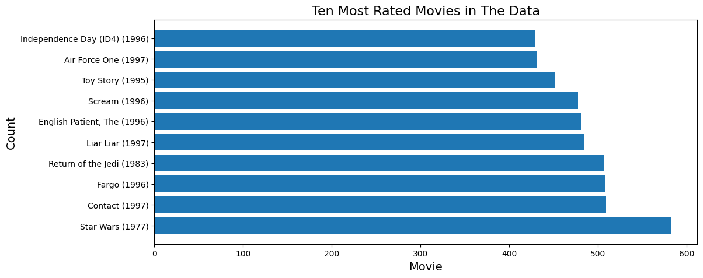
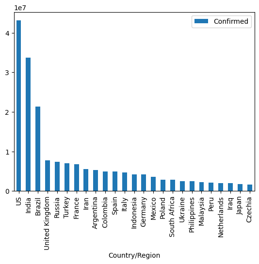
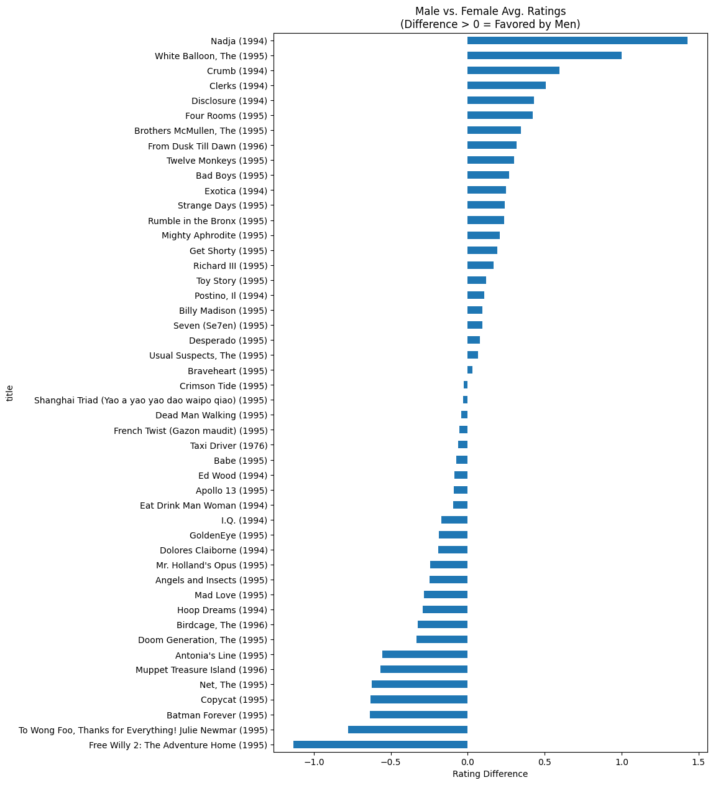
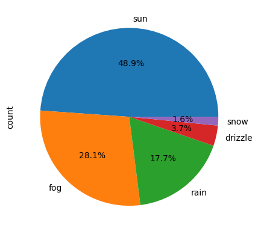
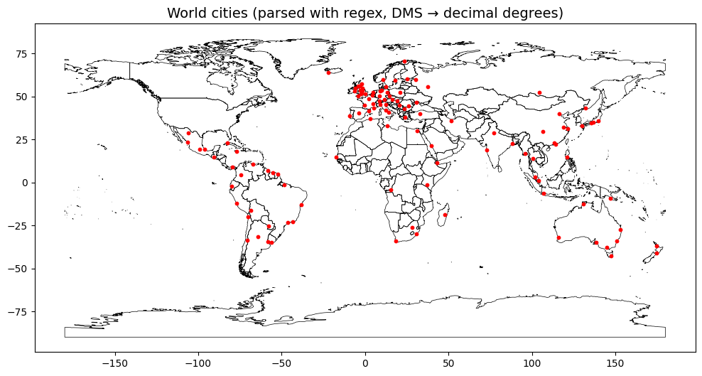
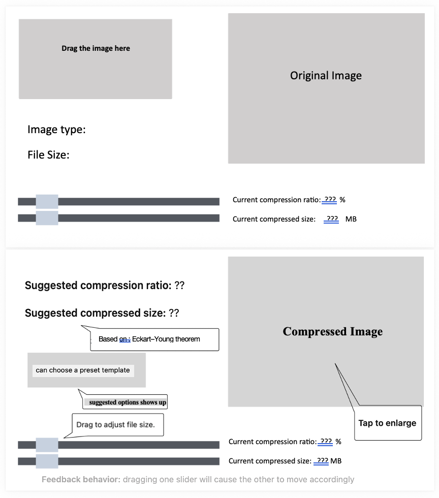
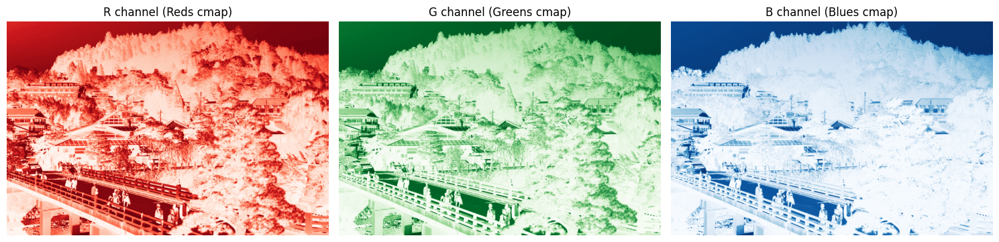
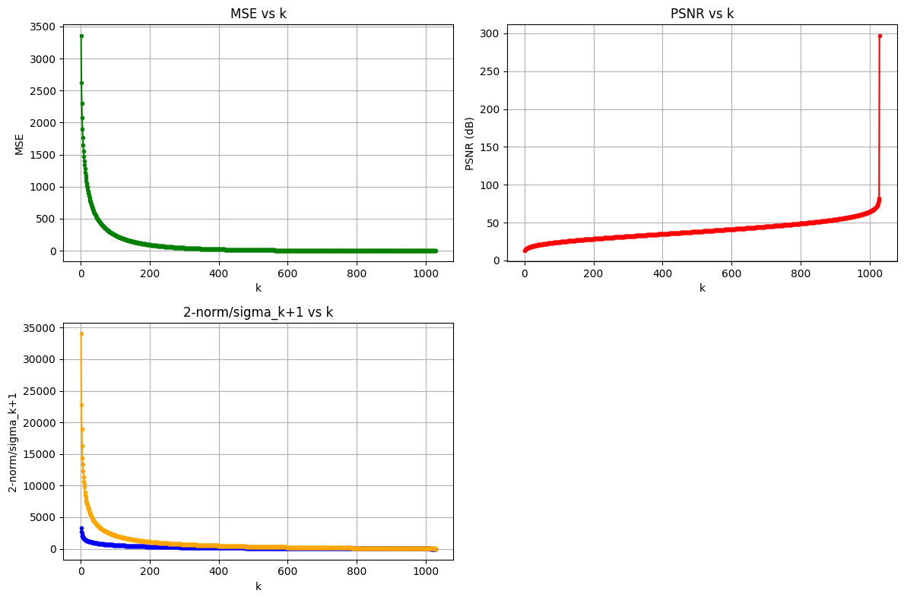

```{r setup, include=FALSE}
library(ggplot2)
library(tidyverse)
library(gridExtra)
library(scales)

# Personal visual DNA
c1  <- "#18A3A3"      # teal (primary)
c2  <- "#FF4D8D"      # rose pink (accent)
c3  <- "#7A7A7A"      # mid grey
c4  <- "#000000"      # border / text
acc <- "#E65100"      # deep orange (trend / highlight)

theme1 <- function() {
  theme_minimal(base_family = "sans") +
    theme(
      text             = element_text(colour = c4),
      plot.title       = element_text(face = "bold", colour = c4, size = 13,
                                      hjust = 0.5),
      plot.subtitle    = element_text(colour = c3, size = 10, hjust = 0.5),
      axis.title       = element_text(colour = c4, size = 11),
      axis.text        = element_text(colour = c3),
      panel.grid.major = element_line(color = scales::alpha(c3, 0.3),
                                      linetype = "dotted"),
      panel.grid.minor = element_blank(),
      legend.text      = element_text(colour = c4),
      legend.title     = element_text(colour = c4, face = "bold")
    )
}
```

## Assignments {#assignments}

### Lab 2 — Retirement Calculator

**Topic:** A financial-planning tool built on compound-interest calculations.

**Key Concepts:** Functions, loops, formatted output, compound interest

```{mermaid}
%%{init: {"theme": "base", "themeVariables": {"fontSize": "18px"}, "flowchart": {"padding": 35}}}%%
flowchart LR
    A["User Input     "] --> B["Monthly Contribution     "] --> C["Compound Interest     "] --> D["Year-by-Year Projection     "] --> E["Millionaire Calculator     "]

    style A fill:#E3F2FD,color:#1565C0,stroke:#90CAF9,stroke-width:2px
    style B fill:#F5F5F5,color:#424242,stroke:#BDBDBD,stroke-width:2px
    style C fill:#FFF3E0,color:#E65100,stroke:#FFCC80,stroke-width:2px
    style D fill:#E8F5E9,color:#2E7D32,stroke:#A5D6A7,stroke-width:2px
    style E fill:#E8F5E9,color:#2E7D32,stroke:#A5D6A7,stroke-width:2px
```

::: {.chart-note .teal}
**Three modes:** (1) Year-by-year fund projection (monthly compounding), (2) Millionaire calculator (years until \$1M), (3) Interest-rate comparison table (1–30% annual). Example: \$500/month at 10% annual return for 30 years → **\$1.14M**.
:::

```python
# Year-by-year retirement fund projection
def calculate_fund(monthly, rate, years):
    balance = 0
    monthly_rate = rate / 12
    for year in range(1, years + 1):
        for month in range(12):
            balance += monthly
            balance *= (1 + monthly_rate)
        print(f"Year {year:3d}: ${balance:>12,.2f}")
    return balance

# Millionaire Calculator
def years_to_million(monthly, rate):
    balance, months = 0, 0
    monthly_rate = rate / 12
    while balance < 1_000_000:
        balance += monthly
        balance *= (1 + monthly_rate)
        months += 1
    return months // 12, months % 12
```

```{r lab2-compound, echo=FALSE, fig.width=7, fig.height=4}
years <- 1:30
balance <- numeric(30)
monthly <- 500
rate <- 0.10
bal <- 0
for (y in years) {
  for (m in 1:12) {
    bal <- (bal + monthly) * (1 + rate / 12)
  }
  balance[y] <- bal
}

df_ret <- data.frame(year = years, balance = balance / 1000)

ggplot(df_ret, aes(x = year, y = balance)) +
  geom_area(fill = c1, alpha = 0.3) +
  geom_line(colour = c1, linewidth = 1.5) +
  geom_hline(yintercept = 1000, linetype = "dashed", colour = acc, linewidth = 0.8) +
  annotate("text", x = 5, y = 1050, label = "$1M milestone",
           colour = acc, size = 3.5, hjust = 0, fontface = "bold") +
  geom_point(data = df_ret[which.min(abs(df_ret$balance - 1000)), ],
             aes(x = year, y = balance), colour = acc, size = 4, shape = 18) +
  scale_y_continuous(labels = function(x) paste0("$", x, "K")) +
  labs(title = "Retirement Fund Growth ($500/mo, 10% annual return)",
       x = "Year", y = "Balance") +
  theme1()
```

::: {.chart-note .orange}
**Compound interest effect:** Slow growth in the first 15 years, exponential acceleration in the next 15. \$500/month at 10% annual return reaches \$1M in roughly **21 years** (<span style="color:#E65100;">orange diamond</span>). Compounding is the core driver of long-term investing.
:::

---

### Lab 3 — Gradebook Manager

**Topic:** Interactive student grade management with full CRUD operations.

**Key Concepts:** Lists, nested data structures, menu-driven programming, input validation

```python
# Menu-driven gradebook
def main_menu():
    while True:
        print("\n1. Add student")
        print("2. Remove student")
        print("3. Modify grade")
        print("4. Display gradebook")
        print("5. Find highest/lowest")
        print("6. Exit")
        choice = input("Select: ")
        # ... handle each option
```

::: {.chart-note .grey}
**Design highlights:** Stores student records as a nested list `[name, grade]` and uses a `while` loop to drive a persistent interactive menu. Includes input validation (grades 0–100) and error handling.
:::

---

### Lab 4 — Modules, Functions & OOP

**Topic:** Modular programming, reusable modules, and object-oriented design.

**Key Concepts:** Module imports, OOP (classes), CSV I/O, distance calculations

```{mermaid}
%%{init: {"theme": "base", "themeVariables": {"fontSize": "18px"}, "flowchart": {"padding": 35}}}%%
flowchart TD
    A["Lab 4 Modules     "] --> B["(a) CSV Field Counter     "]
    A --> C["(b) Parcel Tax Calculator     "]
    A --> D["(c) Distance Calculator     "]

    B --> B1["mycount.py + callingscript.py     "]
    C --> C1["parcelclass.py → OOP     "]
    D --> D1["Euclidean + Great Circle     "]

    style A fill:#E3F2FD,color:#1565C0,stroke:#90CAF9,stroke-width:2px
    style B fill:#FFF3E0,color:#E65100,stroke:#FFCC80,stroke-width:2px
    style C fill:#E8F5E9,color:#2E7D32,stroke:#A5D6A7,stroke-width:2px
    style D fill:#F3E5F5,color:#6A1B9A,stroke:#CE93D8,stroke-width:2px
    style B1 fill:#F5F5F5,color:#424242,stroke:#BDBDBD,stroke-width:2px
    style C1 fill:#F5F5F5,color:#424242,stroke:#BDBDBD,stroke-width:2px
    style D1 fill:#F5F5F5,color:#424242,stroke:#BDBDBD,stroke-width:2px
```

```python
# (b) Parcel class with tax assessment
class Parcel:
    def __init__(self, parcel_id, land_use, market_value):
        self.parcel_id = parcel_id
        self.land_use = land_use
        self.market_value = market_value

    def assess_tax(self):
        rates = {"SFR": 0.05, "MFR": 0.04}
        rate = rates.get(self.land_use, 0.02)
        return self.market_value * rate

# (c) Great Circle Distance (Haversine formula)
import math
def great_circle(lat1, lon1, lat2, lon2):
    R = 6371  # Earth radius in km
    dlat = math.radians(lat2 - lat1)
    dlon = math.radians(lon2 - lon1)
    a = (math.sin(dlat/2)**2 +
         math.cos(math.radians(lat1)) *
         math.cos(math.radians(lat2)) *
         math.sin(dlon/2)**2)
    return R * 2 * math.asin(math.sqrt(a))
```

::: {.chart-note .teal}
**Three sub-tasks:** (a) Count empty values per column in a CSV file, (b) Use OOP to build a `Parcel` class that assesses property tax (SFR 5%, MFR 4%, others 2%), (c) Compute the great-circle distance between two points on Earth using the Haversine formula.
:::

---

### Lab 5 — Pandas Data Analysis

**Topic:** DataFrame manipulation, grouping, pivoting, and multi-dataset merging.

**Datasets:** MovieLens (100K ratings), COVID-19 global time series

**Key Concepts:** pandas Series/DataFrame, boolean indexing, GroupBy, pivot tables, merge/join

```python
# COVID-19 fatality rate analysis
fatality = (deaths_total / confirmed_total * 100).sort_values(ascending=False)
# Peru: 9.17%, Mexico: 7.58%, South Africa: 2.68%

# MovieLens: most rated movies
top_movies = ratings.groupby('movieId').size().sort_values(ascending=False).head(10)

# Multi-DataFrame merge
merged = pd.merge(users, ratings, on='userId')
merged = pd.merge(merged, movies, on='movieId')
```

::: {.chart-note .orange}
**Analysis highlights:** (1) MovieLens — identifying the most-rated movies and the films with the largest male/female rating gap; (2) COVID-19 — top-25 countries by confirmed cases, fatality-rate ranking (Peru highest at 9.17%), and monthly increment analysis (the US gained +4.3M cases in September 2021).
:::

---

### Lab 6 — Data Visualization

**Topic:** Publication-quality charts with matplotlib and interactive plots with Altair.

**Datasets:** MovieLens, COVID-19, Seattle weather (Vega)

::: {layout-ncol=2}



:::

::: {layout-ncol=2}



:::

::: {.chart-note .teal}
**Visualization techniques:** Horizontal bar charts to compare review counts, scatter plots to expose male/female rating differences, pie charts for weather-type distribution, and line charts to track COVID-19 trends. The Altair section also produced an interactive linked chart (click a country → reveal its death-trend curve).
:::

---

### Lab 7 — GUI Development with PyQt5

**Topic:** Building a desktop number-guessing game with a graphical interface.

**Key Concepts:** PyQt5 widgets, event-driven programming, signal/slot, Qt Designer

```{mermaid}
%%{init: {"theme": "base", "themeVariables": {"fontSize": "18px"}, "flowchart": {"padding": 35}}}%%
flowchart LR
    A["Qt Designer     "] --> B["frmGuess.py     "] --> C["lab7.py     "] --> D["Number Game GUI     "]

    style A fill:#F5F5F5,color:#424242,stroke:#BDBDBD,stroke-width:2px
    style B fill:#E3F2FD,color:#1565C0,stroke:#90CAF9,stroke-width:2px
    style C fill:#FFF3E0,color:#E65100,stroke:#FFCC80,stroke-width:2px
    style D fill:#E8F5E9,color:#2E7D32,stroke:#A5D6A7,stroke-width:2px
```

```python
# Number guessing game with hint system
class GuessGame:
    def __init__(self):
        self.target = random.randint(1, 100)
        self.guesses = 0

    def make_guess(self, n):
        self.guesses += 1
        if n == self.target:
            return "Correct!"
        return "Higher!" if n < self.target else "Lower!"

    def use_hint(self):
        """Costs 5 guesses, reveals number within ±5"""
        self.guesses += 5
        return (self.target - 5, self.target + 5)
```

::: {.chart-note .grey}
**GUI features:** A 1–100 random-number guessing game with (1) guess tracking, (2) a hint system that costs 5 guesses and narrows the target window to ±5, and (3) win detection plus reset. The interface is laid out in Qt Designer; `frmGuess.py` is the auto-generated UI code.
:::

---

### Lab 8 — ArcGIS API for Python

**Topic:** Programmatic map creation and spatial-data querying with ArcGIS Online.

**Key Concepts:** ArcGIS authentication, WebMap, FeatureLayer queries, basemap cycling

```python
from arcgis.gis import GIS
from arcgis.mapping import WebMap

gis = GIS("https://www.arcgis.com", username, password)
m = gis.map("University of Texas at Dallas", zoomlevel=15)

# Search and add feature layers
items = gis.content.search("UTD Buildings", item_type="Feature Layer")
m.add_layer(items[0])

# Query building attributes
fl = items[0].layers[0]
fl.properties.fields  # Inspect field schema
```

::: {.chart-note .teal}
**GIS operations:** Connect to ArcGIS Online via the Python API, build an interactive map centered on the UTD campus, search for and overlay building layers, inspect attribute-field schemas, and cycle through different basemap styles.
:::

---

### Lab 10 — Web Scraping & APIs

**Topic:** Extracting data from web sources using APIs and scraping tools.

**Key Concepts:** requests, JSON parsing, BeautifulSoup (HTML), Selenium (dynamic content)

```{mermaid}
%%{init: {"theme": "base", "themeVariables": {"fontSize": "18px"}, "flowchart": {"padding": 35}}}%%
flowchart LR
    A["requests GET     "] --> B["JSON / HTML     "]
    B --> C["BeautifulSoup     "]
    B --> D["json.loads()     "]
    C --> E["Structured Data     "]
    D --> E

    style A fill:#E3F2FD,color:#1565C0,stroke:#90CAF9,stroke-width:2px
    style B fill:#F5F5F5,color:#424242,stroke:#BDBDBD,stroke-width:2px
    style C fill:#FFF3E0,color:#E65100,stroke:#FFCC80,stroke-width:2px
    style D fill:#E8F5E9,color:#2E7D32,stroke:#A5D6A7,stroke-width:2px
    style E fill:#E8F5E9,color:#2E7D32,stroke:#A5D6A7,stroke-width:2px
```

```python
import requests
from bs4 import BeautifulSoup

# RESTful API request
response = requests.get("https://api.example.com/data")
data = response.json()

# HTML scraping
page = requests.get("https://example.com")
soup = BeautifulSoup(page.content, "html.parser")
elements = soup.find_all("div", class_="target")
```

::: {.chart-note .grey}
**Two approaches:** (1) RESTful APIs — send GET/POST requests and parse the JSON response, (2) HTML scraping — use BeautifulSoup to walk the DOM and Selenium to handle dynamically loaded content.
:::

---

### Lab 11 — Regular Expressions & GeoPandas

**Topic:** Parse structured text files with regular expressions and build spatial visualizations with GeoPandas.

**Dataset:** `worldcities.txt` — city coordinates in degrees–minutes format.

```python
import re
import geopandas as gpd
from shapely.geometry import Point

# Parse DMS coordinates with regex
pattern = r"^(.*)\t(\d+)\t(\d+) ([NS])\t(\d+)\t(\d+) ([EW])\t(.*)$"

for line in open("worldcities.txt"):
    match = re.match(pattern, line.strip())
    if match:
        city, lat_d, lat_m, ns, lon_d, lon_m, ew, country = match.groups()
        lat = (int(lat_d) + int(lat_m)/60) * (-1 if ns == 'S' else 1)
        lon = (int(lon_d) + int(lon_m)/60) * (-1 if ew == 'W' else 1)
```

{width="80%"}

::: {.chart-note .teal}
**Pipeline:** Regex extracts city name, lat/lon (in degrees–minutes format), and country from `worldcities.txt` → convert DMS to decimal degrees → build Shapely `Point` geometries → load into a GeoPandas `GeoDataFrame` → overlay on the Natural Earth basemap to plot the global city distribution.
:::

---

## Midterm {#midterm}

### Midterm Project — Data Analysis Suite

Three independent Python programs that demonstrate file operations, data analysis, and real-estate query capability.

```{mermaid}
%%{init: {"theme": "base", "themeVariables": {"fontSize": "18px"}, "flowchart": {"padding": 35}}}%%
flowchart TD
    A["Midterm Project     "] --> B["Alumni Research     "]
    A --> C["File Manipulation     "]
    A --> D["Real Estate Search     "]

    B --> B1["Income & Debt by Major     "]
    C --> C1["Recursive CSV Processing     "]
    D --> D1["Multi-criteria Property Filter     "]

    style A fill:#E3F2FD,color:#1565C0,stroke:#90CAF9,stroke-width:2px
    style B fill:#FFF3E0,color:#E65100,stroke:#FFCC80,stroke-width:2px
    style C fill:#E8F5E9,color:#2E7D32,stroke:#A5D6A7,stroke-width:2px
    style D fill:#F3E5F5,color:#6A1B9A,stroke:#CE93D8,stroke-width:2px
    style B1 fill:#F5F5F5,color:#424242,stroke:#BDBDBD,stroke-width:2px
    style C1 fill:#F5F5F5,color:#424242,stroke:#BDBDBD,stroke-width:2px
    style D1 fill:#F5F5F5,color:#424242,stroke:#BDBDBD,stroke-width:2px
```

#### 1. Alumni Research

Analyze alumni income and student debt: average age and gender breakdown by major, income ranking, and a loan-payoff calculator (5% of annual income as the monthly payment).

```python
# Loan payoff calculator: 5% annual income as monthly payment
def loan_payoff(debt, annual_income, interest_rate=0.05):
    monthly_payment = annual_income * 0.05 / 12
    balance, months = debt, 0
    while balance > 0:
        balance *= (1 + interest_rate / 12)
        balance -= monthly_payment
        months += 1
    return months // 12, months % 12
```

#### 2. File Manipulation

Recursively walk a directory tree, detect CSV files, and pretty-print them in tab-separated format.

```python
import os
def process_directory(path):
    if os.path.isfile(path) and path.endswith('.csv'):
        pretty_print_csv(path)
    elif os.path.isdir(path):
        for root, dirs, files in os.walk(path):
            for f in files:
                if f.endswith('.csv'):
                    pretty_print_csv(os.path.join(root, f))
```

#### 3. Real Estate Search

Multi-criteria property filter: state code, minimum living area, market-value range, and target school district.

::: {.chart-note .orange}
**Midterm summary:** Three programs that exercise (1) pandas data analysis and joining (`merge on ID`), (2) recursive file processing with `os.walk()`, and (3) multi-criterion logical filtering. Together they cover data science, system operations, and practical applications.
:::

---

## Final Project {#final-project}

### SVD Image Compression Application

**Task:** Build an interactive desktop application for image compression using Singular Value Decomposition (SVD), with real-time preview and quality metrics.

**Method:** PyQt6 GUI + NumPy SVD + PIL image processing

**Mathematical Foundation:** Eckart–Young Theorem — A_k = sum(sigma_i · u_i · v_iᵀ) for i = 1 … k

#### Application Architecture

```{mermaid}
%%{init: {"theme": "base", "themeVariables": {"fontSize": "18px"}, "flowchart": {"padding": 35}}}%%
flowchart TD
    A["Image Input (drag & drop)     "] --> B["RGB Channel Split     "]
    B --> C["np.linalg.svd per channel     "]
    C --> D["Low-rank Approximation A_k     "]
    D --> E["Reconstruct RGB     "]
    E --> F["PSNR + File Size     "]
    F --> G["Preview & Export     "]

    style A fill:#E3F2FD,color:#1565C0,stroke:#90CAF9,stroke-width:2px
    style B fill:#E3F2FD,color:#1565C0,stroke:#90CAF9,stroke-width:2px
    style C fill:#FFF3E0,color:#E65100,stroke:#FFCC80,stroke-width:2px
    style D fill:#FFF3E0,color:#E65100,stroke:#FFCC80,stroke-width:2px
    style E fill:#E8F5E9,color:#2E7D32,stroke:#A5D6A7,stroke-width:2px
    style F fill:#F3E5F5,color:#6A1B9A,stroke:#CE93D8,stroke-width:2px
    style G fill:#E8F5E9,color:#2E7D32,stroke:#A5D6A7,stroke-width:2px
```

::: {.chart-note .teal}
**SVD foundations:** Any matrix `A` decomposes as `A = U Σ Vᵀ`. Taking the top-`k` singular values to rebuild `A_k` yields the best rank-`k` approximation (Eckart–Young theorem). Smaller `k` means higher compression but lower quality.
:::

#### Core Algorithm

```python
import numpy as np
from PIL import Image

def perform_svd(image_array):
    """SVD on each RGB channel separately"""
    channels = {}
    for i, name in enumerate(['R', 'G', 'B']):
        U, S, Vt = np.linalg.svd(image_array[:, :, i], full_matrices=False)
        channels[name] = (U, S, Vt)
    return channels

def reconstruct(channels, k):
    """Low-rank approximation with k singular values"""
    reconstructed = np.zeros_like(original)
    for i, name in enumerate(['R', 'G', 'B']):
        U, S, Vt = channels[name]
        reconstructed[:, :, i] = np.clip(
            U[:, :k] @ np.diag(S[:k]) @ Vt[:k, :], 0, 255
        )
    return reconstructed.astype(np.uint8)

def calculate_psnr(original, compressed):
    mse = np.mean((original.astype(float) - compressed.astype(float)) ** 2)
    return 10 * np.log10(255**2 / mse) if mse > 0 else float('inf')
```

#### GUI Features

```python
# PyQt6 GUI with dual slider control
class SVDCompressor(QMainWindow):
    def __init__(self):
        # Drag-and-drop image upload
        # Dual slider: compression ratio ↔ target file size (linked)
        # Smart presets:
        #   Social media: 2 MB, ~35 dB PSNR
        #   Email:        5 MB, ~40 dB PSNR
        #   High quality: 80% compression, ~45 dB PSNR
        pass
```

#### Application Demo

{width="80%"}

::: {.chart-note .orange}
**App feature highlights:**

- **Drag-and-drop upload** — drop an image into the window to load it
- **Linked dual sliders** — compression ratio ↔ target file size (moving one auto-updates the other)
- **Smart presets** — three templates: social media (2 MB), email attachment (5 MB), high-quality archive (PSNR > 40 dB)
- **Live preview** — side-by-side original vs compressed, with PSNR / file size / compression ratio shown below
- **Quality warnings** — automatic alert when PSNR drops below 40 dB
- **Eckart–Young guarantee** — theoretically optimal low-rank approximation
:::

📎 **Download:** [SVD_app.py (source code)](SVD_app.py)

#### SVD Quality Analysis

::: {layout-ncol=2}



:::

```{r svd-psnr, echo=FALSE, fig.width=8, fig.height=4}
k_vals <- c(1, 10, 50, 100, 200, 300, 500, 700)
psnr_vals <- c(12.5, 20.3, 27.1, 29.5, 31.0, 31.88, 38.2, 44.70)
mse_vals  <- c(3650, 605, 127, 73, 51.6, 42.29, 9.8, 2.2)

df_svd <- data.frame(k = k_vals, psnr = psnr_vals, mse = mse_vals)

p1 <- ggplot(df_svd, aes(x = k, y = psnr)) +
  geom_line(colour = c1, linewidth = 1.5) +
  geom_point(colour = c1, size = 3) +
  geom_hline(yintercept = 30, linetype = "dashed", colour = c3, linewidth = 0.8) +
  annotate("text", x = 50, y = 31, label = "30 dB (good quality)",
           colour = c3, size = 3.2, hjust = 0) +
  geom_point(data = df_svd[df_svd$k == 300, ], colour = acc, size = 5, shape = 18) +
  annotate("label", x = 300, y = 34,
           label = "k=300: 31.88 dB", colour = acc, size = 3,
           fontface = "bold", fill = "white", label.size = 0) +
  labs(title = "PSNR vs Singular Values (k)", x = "k", y = "PSNR (dB)") +
  theme1()

p2 <- ggplot(df_svd, aes(x = k, y = mse)) +
  geom_line(colour = c2, linewidth = 1.5) +
  geom_point(colour = c2, size = 3) +
  scale_y_log10() +
  labs(title = "MSE vs Singular Values (k)", x = "k", y = "MSE (log scale)") +
  theme1()

grid.arrange(p1, p2, ncol = 2,
             top = grid::textGrob("SVD Image Compression — Quality vs Compression Level",
                                  gp = grid::gpar(fontface = "bold", fontsize = 13)))
```

::: {.chart-note .pink}
**Quality analysis:** Left — PSNR rises with `k`, reaching **31.88 dB** at `k = 300` (above the 30 dB threshold marked by the <span style="color:#7A7A7A;">grey dashed line</span>) and approaching the original at `k = 700` (44.70 dB). Right — MSE drops exponentially, with diminishing returns past `k = 300`. **Practical takeaway:** `k = 200–400` is the sweet spot between compression and quality.
:::

| k | PSNR (dB) | MSE | Compression Ratio |
|---|-----------|-----|-------------------|
| 1 | 12.50 | 3650 | 99.9% |
| 50 | 27.10 | 127 | 95.1% |
| 100 | 29.50 | 73 | 90.3% |
| **300** | **31.88** | **42.29** | **70.9%** |
| 700 | 44.70 | 2.2 | 32.0% |

::: {.chart-note .orange}
**Eckart–Young verification:** Experiments confirm ‖A − A_k‖₂ ≈ σ_{k+1} — the error of the low-rank approximation equals the (k+1)-th singular value. This gives a principled rule for choosing `k`: stop once σ_{k+1} drops below the desired quality threshold.
:::

---

## Course Skills Summary

```{r skills-summary, echo=FALSE, fig.width=8, fig.height=4.5}
df_skills <- data.frame(
  category = factor(
    c("Core Python", "Data Science", "GIS & Spatial", "GUI Dev", "Web & APIs", "Math & Algorithms"),
    levels = c("Math & Algorithms", "Web & APIs", "GUI Dev", "GIS & Spatial", "Data Science", "Core Python")
  ),
  labs = c(6, 4, 3, 2, 2, 2),
  tools = c(
    "Functions, OOP\nFile I/O, Regex",
    "pandas, NumPy\nmatplotlib, Altair",
    "ArcGIS API\nGeoPandas, Shapely",
    "PyQt5/6\nQt Designer",
    "requests, BS4\nSelenium, JSON",
    "SVD, Haversine\nPSNR, MSE"
  )
)

ggplot(df_skills, aes(x = labs, y = category, fill = category)) +
  geom_col(colour = c4, width = 0.6) +
  geom_text(aes(label = tools), hjust = -0.05, size = 2.8, colour = c4, lineheight = 0.9) +
  scale_fill_manual(values = c(c1, c2, "#FF9800", "#9C27B0", "#4CAF50", c3)) +
  scale_x_continuous(limits = c(0, 12), expand = c(0, 0)) +
  labs(title = "GIS & Python — Skills Coverage Across Labs",
       x = "Number of Labs", y = NULL) +
  theme1() +
  theme(legend.position = "none")
```

::: {.chart-note .teal}
**Course wrap-up:** From core Python (functions, OOP, file I/O), through data science (pandas, visualization), GIS and spatial analysis (ArcGIS, GeoPandas), GUI development (PyQt5/6), and web scraping (requests, BeautifulSoup), to a final SVD image-compression project that fuses mathematical theory with software-engineering practice.
:::
